# ReviewLens admin guide

**Inspect research runs, govern configuration, and monitor model usage.**

[Project overview](README.md) · [User guide](USERS.md) · [Architecture](APP.md) · [Deployment](DEPLOYMENT.md)

This guide covers the protected control plane at [http://localhost:3000/admin](http://localhost:3000/admin). Configure the local stack and administrator account using the [setup instructions](README.md#run-locally).

The deployed control plane is at [Azure admin sign-in](https://reviewlens-yassir.spaincentral.cloudapp.azure.com/admin/login). It has a separate production database, so the local example runs shown here will not appear there. See [DEPLOYMENT.md](DEPLOYMENT.md) for production status, maintenance, and backup procedures.

Screenshots show the running local control plane after its data loaded. Run traces follow the real Sony example in the [user guide](USERS.md#worked-example-sony-wh-1000xm5). Costs, catalog prices, active versions, alerts, and projection states reflect this installation at capture time and can change.

## Worked example: inspect the same Sony run

The public example analyzed **Sony WH-1000XM5 headphones**, requesting three reviews with comments enabled. Its run is `52384bb5-9554-4074-a56f-3b446d69edaa`.

1. Open **Runs**, enter `Sony WH-1000XM5` in **Product**, and choose **Apply**.
2. Open the entry for run `52384bb5-9554-4074-a56f-3b446d69edaa` to inspect this run's trace. Earlier runs can have the same product name.
3. Compare its **45,269 tokens**, **12 model calls**, **29 tasks**, and **30 attempts** with the finished public report. The local ledger recorded **$0.0079**, with no pending usage entries.
4. Expand **Attempts and recovery** on `analyze_audience.source_1`. Both recorded attempts failed with `agent_output_reference_invalid`. This explains the comment warning; successful audience results from other sources remain in the report.
5. Inspect **Model usage**, then follow **Open workspace graph** to inspect its stored evidence and projection status.

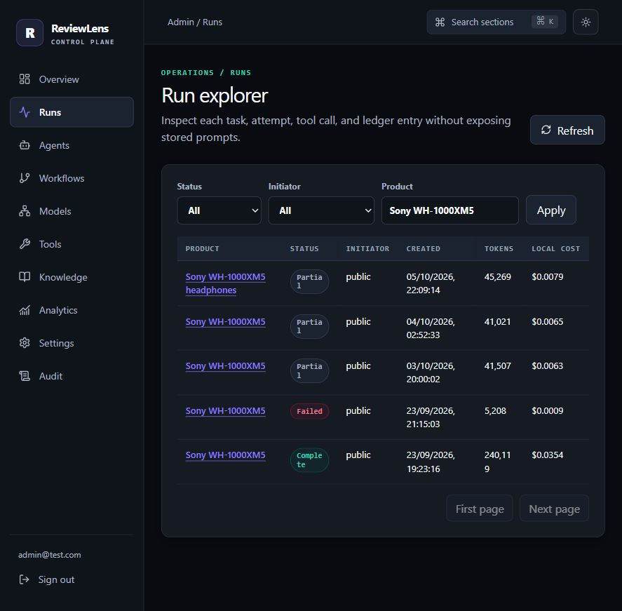

*The filtered explorer includes the fresh run and earlier analyses. Select the named run to inspect its own immutable history.*

This walkthrough inspected the existing records and configuration. It did not retry the failed task, revoke the report, or change active agent/workflow versions. Those actions are available when needed and are explained below.

## 1. Sign in and navigate

Open `/admin/login`, enter the administrator email and configured password, and press **Sign in**. Admin credentials belong to the server's configured administrator account. The public researcher's account uses a separate sign-in flow described in the [user guide](USERS.md#7-use-an-optional-account-for-history).

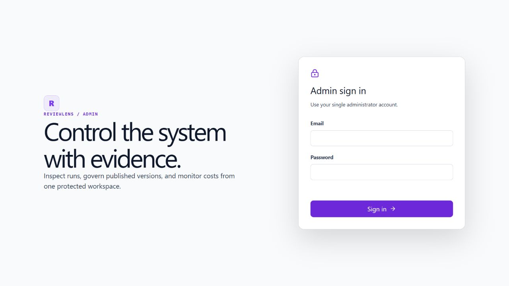

*Admin access opens the protected control plane.*

The sidebar links the main sections. **Search sections** or **Ctrl/Cmd + K** opens the section picker. On narrower screens, use **Open navigation**. Use **Sign out** at the end of an admin session.

| Section | Route | What you can do |
|---|---|---|
| Overview | `/admin` | Read recent run counts, local usage, credit status, and operational alerts |
| Runs | `/admin/runs` | Filter runs, inspect attempts and usage, and access eligible recovery controls |
| Agents | `/admin/agents` | Assign role models and inspect/edit versioned agent definitions |
| Workflows | `/admin/workflows` | Inspect task graphs, edit drafts, validate, publish, and activate workflows |
| Models | `/admin/models` | Search model/provider snapshots and manage model, embedding, and budget policies |
| Tools | `/admin/tools` | Inspect the published tool registry and recorded invocations |
| Knowledge | `/admin/knowledge` | Inspect stored workspaces, node versions, text, and projection health |
| Analytics | `/admin/analytics` | Filter usage breakdowns and export CSV |
| Settings | `/admin/settings` | Manage system versions, evaluation limits, emergency stop, and sessions |
| Audit | `/admin/audit` | Inspect receipts for configuration and operational actions |

## 2. Check system health and usage

Start with **Overview**. **Local cost** and **Tokens** come from the application's usage ledger. **OpenRouter credit** is a separate upstream account indicator; unavailable credit data is shown as unavailable.

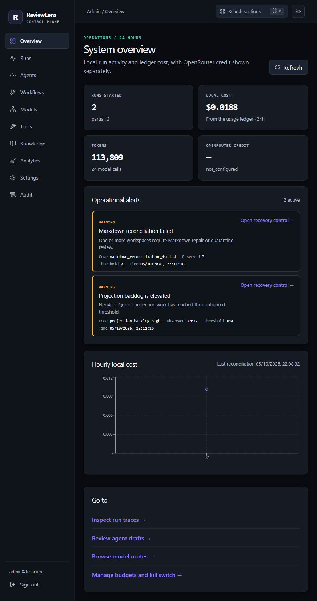

*Actual alerts show their code, observed value, threshold, time, and recovery link. This capture includes Markdown reconciliation and projection-backlog warnings.*

Read **Operational alerts** before investigating a stalled run. Follow the recovery link, inspect the relevant records, and use **Refresh** after addressing the underlying dependency. A worker-availability problem requires restoring the worker; changing a prompt does not restore task execution.

For a usage breakdown, open **Analytics**, select **Hourly** or **Daily**, choose a grouping such as model, provider, agent, operation, or initiator, and set the date range. **Exact key** narrows a selected dimension. Use **Export CSV** to download the filtered data. Pending or stale accounting should be resolved before treating aggregates as final.

## 3. Diagnose a research run

1. Open **Runs**.
2. Filter by **Status**, **Initiator**, and **Product**, then apply the filters.
3. Select the product to open its run trace.
4. Inspect the status, tasks, token total, cost, pending ledger entries, and task DAG.
5. Expand **Attempts and recovery** for the relevant task. Read the attempt number, failure code, duration, and available context/tool records.
6. Inspect **Model usage** and **Tool audits and snapshot** to identify the model/provider used and the workflow/budget versions.

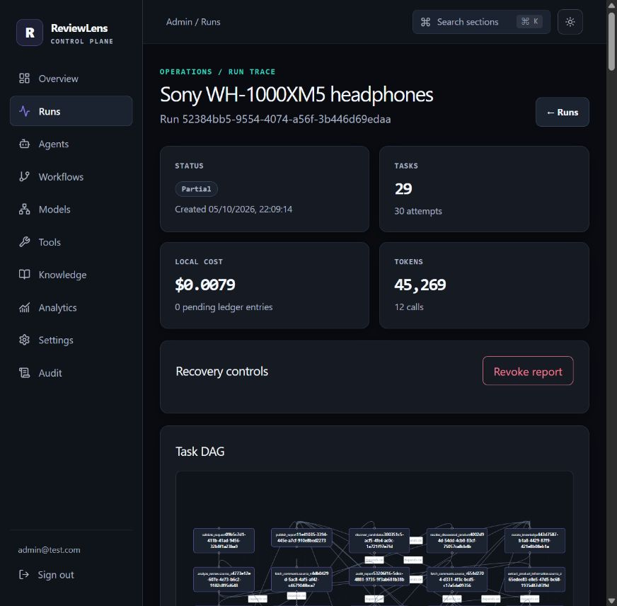

*The report published with evidence warnings. Its trace shows task/attempt totals, recorded usage, and the available recovery controls.*

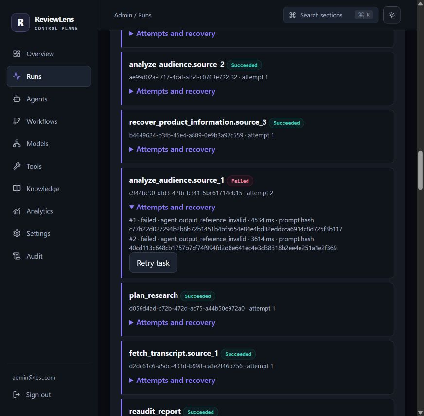

*Both audience attempts retain the failure code and duration. The screenshot shows the eligible retry control; no retry was submitted for this documentation.*

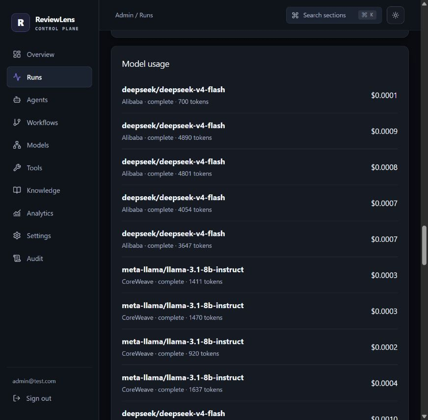

*Review work and audience work can use different policies. Each recorded call exposes its actual model, provider, tokens, and ledger cost to the administrator.*

Use the controls according to the run's state:

| Action | Effect |
|---|---|
| **Retry task** | Request another eligible attempt while preserving the previous attempt |
| **Cancel run** | Stop eligible queued/running work |
| **Revoke report** | Remove public access to the report link |
| **Open workspace graph** | Inspect the evidence workspace associated with the run |

Recovery and publication actions use confirmation dialogs. Read the described effect and enter the displayed confirmation phrase. Retry eligibility, deadlines, configuration, and budget still apply. A retry can incur additional model usage.

## 4. Choose models for agent roles

In **Agents**, the **Agent LLM Models** view shows the available role assignments. Supported review roles can use **Default LLM** or **Custom LLM**. Audience analysis uses its dedicated policy, and its selector reflects those restrictions.

Select compatible models, then use **Save & Apply Models**. This path saves the assignments and updates the active workflow for new runs. **Reset All to Default** changes the selected assignments in the form; save/apply the result to commit that choice. Existing analyses retain their original configuration snapshots.

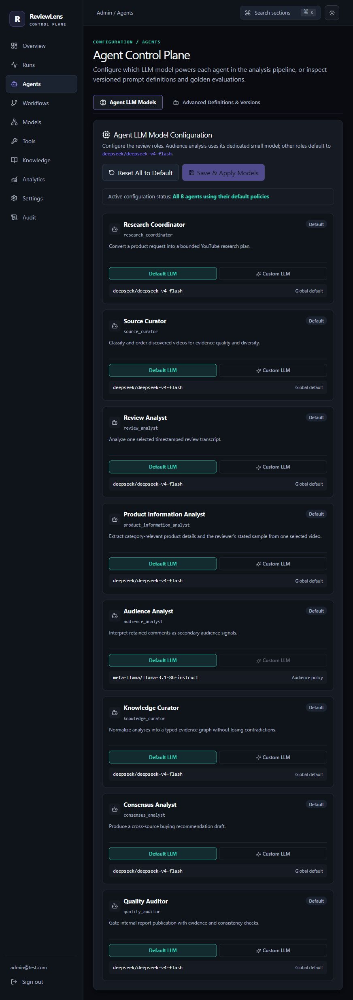

*The role assignments have finished loading. Audience analysis displays its dedicated policy.*

For catalog inspection, open **Models**:

1. Search by name or slug.
2. Filter by chat/embedding type, author, provider, capability, context size, prompt price, or availability.
3. Select a model to inspect provider endpoints, supported parameters, privacy metadata, and eligibility information.
4. Use the policy sections for versioned routing, embedding, and budget settings.

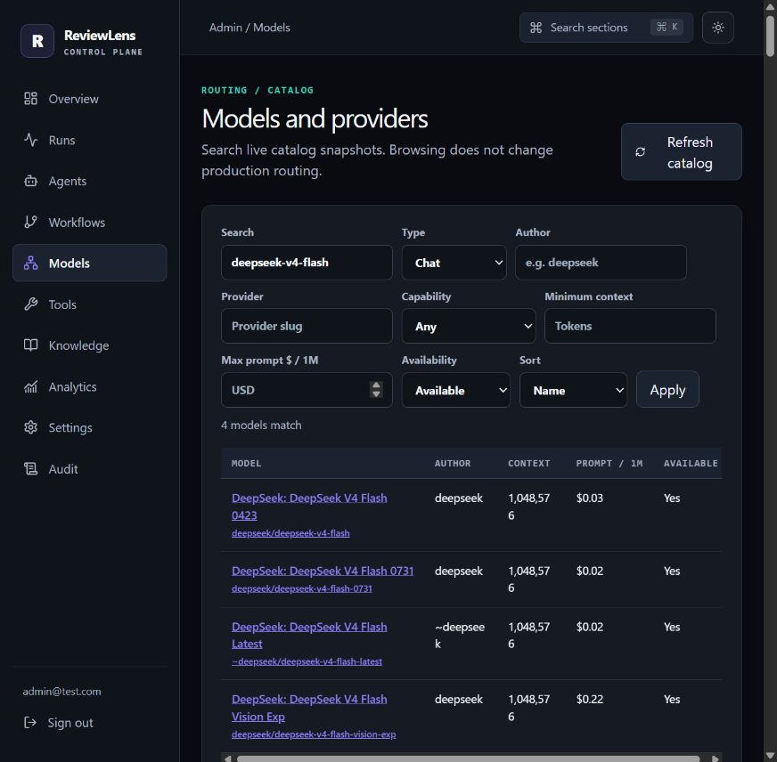

*The filtered catalog contains actual cached model metadata. Selecting a model row opens its endpoints.*

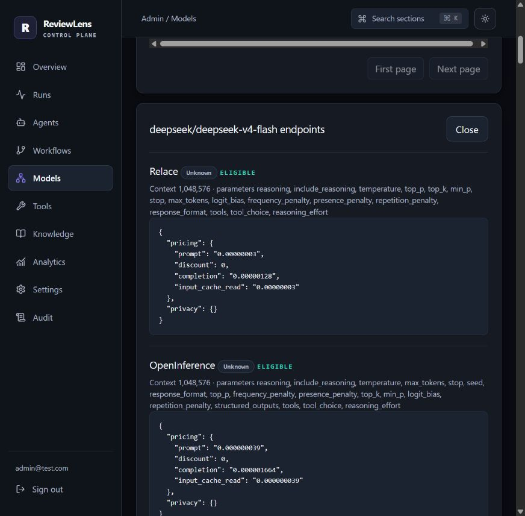

*Endpoint details expose context limits, supported parameters, pricing, and eligibility. The listed data is a captured catalog snapshot.*

Browsing the catalog does not select a production model. **Refresh catalog** queues a refresh job; routing changes must be saved through the applicable configuration controls. Inspect the current catalog in your environment before choosing a policy.

## 5. Edit agents and workflows through versions

For prompts, schemas, tools, and retrieval limits, open **Agents → Advanced Definitions & Versions** and select **Open versions** on an agent. Workflows use the same versioned configuration pattern in **Workflows**.

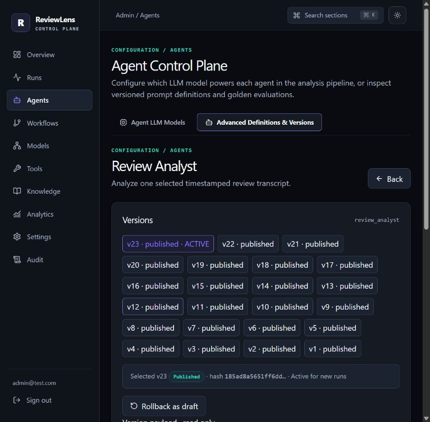

*The active published version is read-only. **Rollback as draft** creates the editable successor used in the steps below.*

1. Select the version you want to inspect.
2. From a published version, choose **Rollback as draft** to create an editable successor. **Fork draft** creates another draft from a selected draft.
3. Edit **Configuration JSON** and add a clear **Change note**.
4. Choose **Save draft**, then **Validate**. Resolve schema, model, tool, or workflow compatibility errors.
5. For agent changes, use **Run evaluation** to check the configured evaluation cases and review the result. Live evaluation consumes the shared evaluation budget and can make paid model calls.
6. Choose **Publish** when the draft is ready. Publication freezes that version.
7. For a workflow change, select the published version and choose **Activate** to use it for new runs.

### Publishing and activation are separate

A published agent or model policy must be referenced by the workflow that new runs use. When changing those definitions through the version editor, update the workflow draft to reference the intended published versions, validate it, publish it, and activate it.

Publishing a workflow alone does not move the active pointer. Check the **ACTIVE** marker and the active version after activation. If your environment is pinned to an older workflow, new runs keep using that version until the active configuration changes.

The quick **Save & Apply Models** path described above performs an active-workflow update as part of its operation. The general version editor keeps publication and activation explicit.

For rollback, create and review a draft based on the desired earlier configuration, publish it, and activate the resulting workflow. Existing runs continue to use their saved snapshots; published history remains inspectable.

## 6. Inspect knowledge and tool activity

Open **Knowledge**, select a workspace, then select a graph node or use **Readable workspace graph list → Inspect**. The node inspector shows available versions and stored text. Use the associated run link to return to the execution trace.

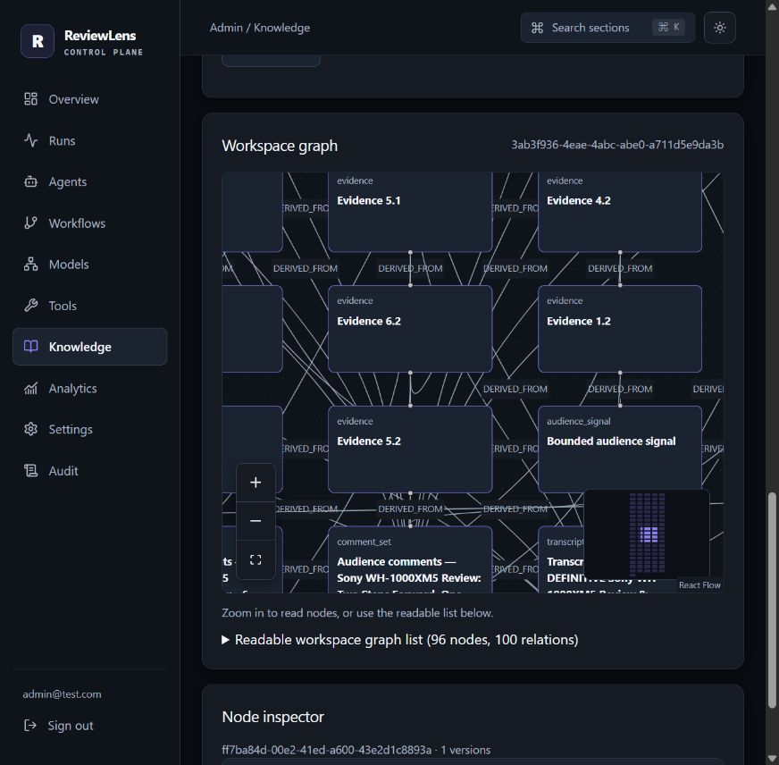

*This close-up uses approximately 100% graph zoom so node titles are readable. The minimap shows the full workspace. Controls and relation labels follow the app's theme. Hover for a full title or use the readable list.*

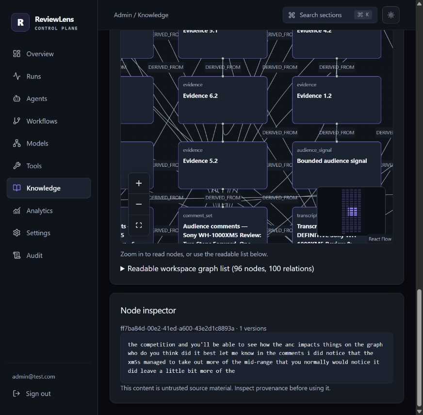

*Click a node card or focus it and press **Enter** to open the inspector. This real evidence excerpt was captured after its body loaded.*

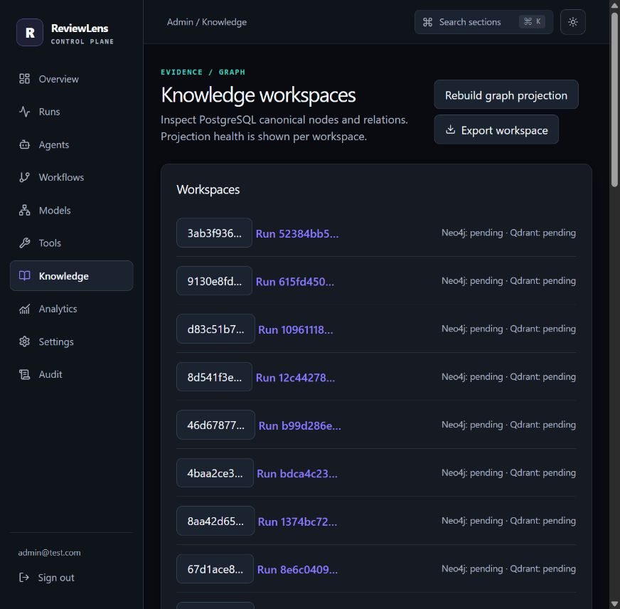

*The first workspace belongs to the worked example. Its pending projection state is separate from the loaded canonical records shown above.*

Check the workspace's **Neo4j** and **Qdrant** status when investigating degraded projections. **Rebuild graph projection** queues a Neo4j rebuild from canonical workspace records. **Export workspace** queues an export job and offers a ZIP download when it succeeds.

Source bodies are untrusted review material. Inspect their provenance before relying on a finding. The [architecture guide](APP.md#6-knowledge-storage-and-context-retrieval) explains which storage records are authoritative.

In **Tools**, inspect the published registry, allowed roles, and recent invocation receipts. Refresh the invocation list to inspect status and timing. Tool definitions expose bounded capabilities rather than an editor for arbitrary executable code.

## 7. Manage operational settings

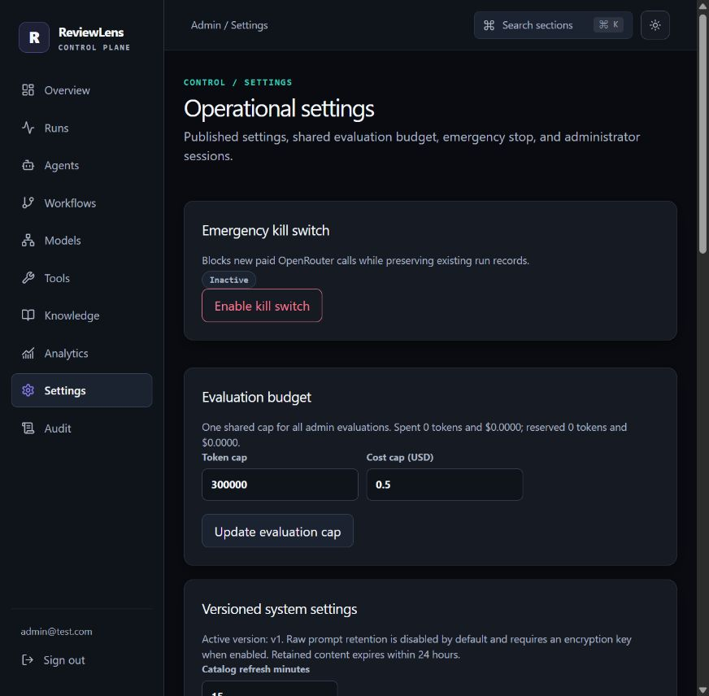

*Settings combines operational controls with versioned system configuration.*

| Control | How to use it |
|---|---|
| **Emergency kill switch** | Enable it to block new paid OpenRouter calls; disable it after resolving the operational problem |
| **Evaluation budget** | Set the shared token and cost caps, then confirm **Update evaluation cap**; committed usage constrains reductions |
| **Versioned system settings** | Create a settings draft, save its values and change note, publish it, then activate the published version |
| **Sessions** | Inspect active administrator sessions and revoke the selected session when needed |

Catalog refresh timing and raw-content retention are system settings. Raw-content retention is disabled by default; enabling it requires the configured encryption support and applies the documented expiry policy. Keep that change deliberate because it affects retained model content.

The **V2 retirement** panel records migration history and is read-only. It is not an application rollback button. The [retirement runbook](docs/operations/phase12-retirement.md) describes deployment rollback, while the [recovery runbook](docs/operations/phase10-runbook.md) covers backups and operational recovery.

## 8. Review audit history

Open **Audit**, filter by an action such as `configuration.activated`, and inspect the paginated records. Use these receipts to confirm a configuration or recovery action and relate it to the run history. The audit list is designed around safe operational metadata.

## Common investigations

| Symptom | Inspect first |
|---|---|
| New runs still use an old prompt | Active workflow and its referenced agent versions; publication alone does not activate it |
| Run appears stuck | Overview alerts, task state, attempts, and worker/scheduler availability |
| Report has sparse product details | Source captions, extraction diagnostics, and the configured optional recovery branch |
| Comment analysis fails | Audience task attempt, output contract, selected model policy, and sample limitations |
| Report is partial with all sources analyzed | Audit warnings and omitted findings, alongside coverage |
| Cost totals appear incomplete | Pending usage entries and aggregate reconciliation status |
| Evidence graph is degraded | Workspace projection status and canonical records before requesting a rebuild |

For the public experience, read [USERS.md](USERS.md). For task execution, evidence validation, budgets, and persistence, read [APP.md](APP.md).
