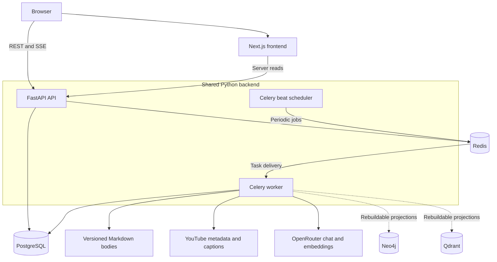
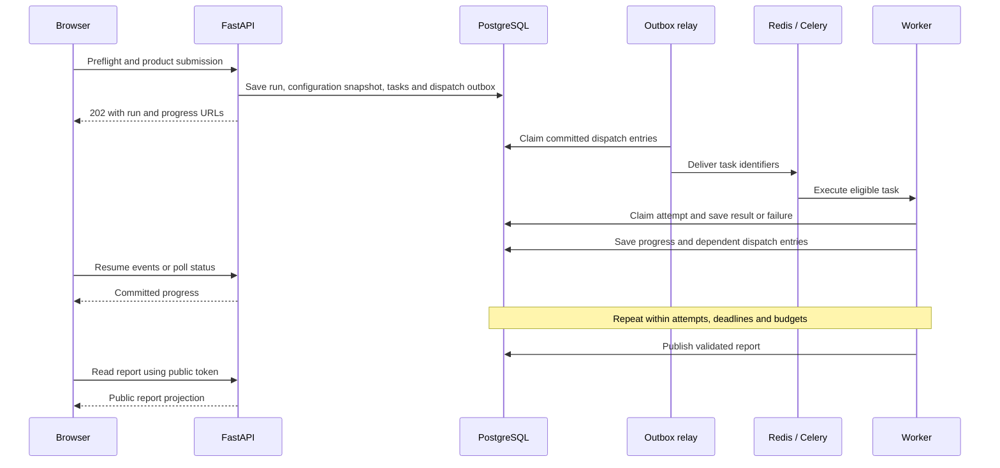
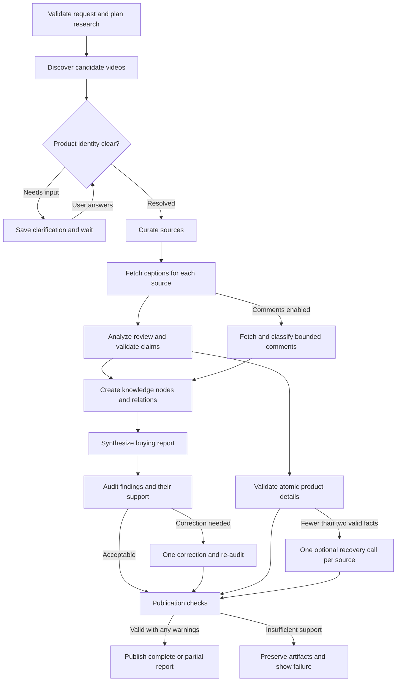

# Inside ReviewLens

**From a product name to a report whose claims can be inspected.**

ReviewLens researches products through selected YouTube reviews. This guide follows a request through the application, explains how evidence reaches a published report, and maps the architecture to the code that implements it.

For instructions with screenshots, see the [user guide](USERS.md) and [admin guide](ADMIN.md). The [real Sony example](USERS.md#worked-example-sony-wh-1000xm5) follows a product request through its finished report; the [matching admin walkthrough](ADMIN.md#worked-example-inspect-the-same-sony-run) inspects the recorded execution.

[Project overview](README.md) · [Deployment](DEPLOYMENT.md) · [User journey](#1-the-user-journey) · [Architecture](#2-system-architecture) · [Research workflow](#4-the-research-workflow) · [Evidence checks](#5-how-evidence-is-validated) · [Code guide](#10-where-to-read-the-code)

## 1. The user journey

### Start the research

Enter a product name, choose three to five review videos, and optionally enable viewer comments. A preflight request checks availability and quotas and returns an estimated token range before submission. Public users select research options; model and provider policies are managed through the admin interface.

An ambiguous name can pause the run for clarification. The app presents product choices derived from discovered sources, saves the selected answer, and resumes the same run. This keeps reviews of related models from silently becoming evidence for the wrong product.

### Follow the analysis

The progress screen shows real task states across discovery, acquisition, analysis, knowledge curation, synthesis, and verification. Source work can finish independently, so the user can see what has completed while other tasks continue.

The browser listens for Server-Sent Events (SSE) and also polls committed status. Reconnecting or refreshing the page does not own the lifetime of the analysis: the worker and database do. A user can cancel a run they own.

### Inspect the result

The report presents a buying verdict, score, confidence, strengths, drawbacks, reviewer disagreements, fit guidance, and source coverage. Evidence excerpts link back to the review video at the available timestamp. Product details include their citations and, where explicitly stated, the configuration a reviewer actually tested.

Comments have a separate status and sampling limitations. The user can explore a simplified evidence graph, share the unlisted report link, or download a PDF.

| Page | Purpose |
|---|---|
| `/` | Submit a product and research options |
| `/analysis/{run_id}` | Follow progress, answer clarification, inspect available details, or cancel |
| `/r/{public_token}` | Read and share a published report |
| `/admin` | Access the protected configuration and operations cockpit |

The [user guide](USERS.md) covers research options, progress, reports, sharing, and optional account history. The [admin guide](ADMIN.md) explains operator tasks and configuration changes.

## 2. System architecture

The backend is a **modular monolith running in separate processes**. FastAPI, the Celery worker, and the scheduler share one Python codebase and database contracts. Docker Compose runs them alongside the frontend and storage services.

| Component | Responsibility |
|---|---|
| **Next.js / React / TypeScript** | Intake, progress, report and evidence views, and the admin UI |
| **FastAPI / Pydantic** | HTTP contracts, authentication, admission, status, report reads, and SSE |
| **Celery worker** | Long tasks, per-source analysis, tool execution, and model calls |
| **Celery beat scheduler** | Outbox delivery, stale-task recovery, catalog refresh, and reconciliation jobs |
| **PostgreSQL / SQLAlchemy / Alembic** | Authoritative run state, attempts, configuration versions, evidence metadata, relations, reports, and usage |
| **Redis** | Celery broker, progress stream mirror, locks, and short-lived operational state |
| **Markdown storage** | Human-readable, versioned knowledge node bodies shared by backend processes |
| **Neo4j** | Graph projection that can be rebuilt from authoritative records |
| **Qdrant** | Vector projection used when semantic retrieval is configured and available |
| **OpenRouter** | Server-side gateway for model inference and embeddings |

The Compose `migrate` service applies database migrations and seeds configuration before the API and workers start. Named volumes preserve the database and Markdown workspaces across restarts. See [the service definitions](docker-compose.yml) for the executable topology.

Docker Desktop shows these services inside one **reviewlens** Compose group. Each service retains its own container; the migration container exits after setup. The [Azure deployment guide](DEPLOYMENT.md) records the actual VM deployment, with Caddy added for HTTPS, private service ports, persistent disks, and backups.

### V2 runtime architecture and retirement

ReviewLens has one V2 runtime. The legacy application and wire contracts are retired. `/` serves the public intake, `/research` permanently redirects to `/`, and product APIs live under `/api/v2`.

Migration `20260920_0009`, compatibility telemetry, and Phase 11 cutover observations remain as historical records. `GET /api/v2/admin/cutover` is read-only and reports the latest passed non-test observation. The runtime has no legacy adapter, root rollback switch, cutover mutation, or scheduled cutover evaluator.

Deployment rollback uses the recorded Phase 11 image against the unchanged database. Deploying over an existing Phase 11 environment requires an authoritative `docs/release-evidence/phase12-cutover.json` export and the evidence gate in the [retirement runbook](docs/operations/phase12-retirement.md). Local development does not require that production artifact.

## 3. What happens after submission

`POST /api/v2/analyses` accepts the request and returns HTTP **202** with a run ID and status/event URLs. It does not keep the HTTP request open while models analyze videos.

At admission, the runtime snapshots the published workflow and its referenced agent, tool, model, and budget versions. Later configuration changes affect new runs; a running analysis retains the versions it started with.

Task dispatch uses a **transactional outbox**: task state and the instruction to enqueue work are saved together. Delivery can happen more than once. Idempotency keys, attempt numbers, and worker leases prevent a duplicate delivery from becoming another independent result. Expired attempts can be recovered within the stored retry policy.

Implementation: [admission](backend/app/public/admission.py), [runtime service](backend/app/runtime/service.py), [outbox](backend/app/runtime/outbox.py), and [worker entry points](backend/app/worker.py).

## 4. The research workflow

The workflow is a directed acyclic graph (DAG): each task declares its dependencies, handler, timeout, retry policy, and optional branches. Code expands the per-source tasks for the requested source slots. Agents return structured proposals; the runtime owns which tasks execute next.

This diagram summarizes the logical flow. Optional branches can skip execution, and publication waits for the required dependency states. A failed optional task is handled according to the workflow and publication rules.

### Roles and deterministic stages

| Stage | Responsibility |
|---|---|
| Research Coordinator | Propose a bounded search plan for the requested product |
| Candidate discovery and identity resolution | Search YouTube, fetch metadata, apply identity checks, and pause for clarification when needed |
| Source Curator | Propose relevant review sources from the supplied candidate set |
| Review Analyst | Extract source-specific judgments, claims, quotations, and product details |
| Product Information Analyst | Recover cited details from a sparse source when the optional recovery branch is eligible |
| Audience Analyst | Classify the selected comments and propose cited recurring signals |
| Knowledge projection | Write validated source analyses and their knowledge relations through deterministic code |
| Consensus Analyst | Propose agreements, disagreements, fit guidance, and a buying summary from supplied evidence |
| Quality Auditor | Check whether report findings are supported by the cited sources |
| Publication | Recheck evidence lineage, apply deterministic scores, and save the report and public projection |

The current default DAG is built in [configuration.py](backend/app/analysis/configuration.py). Prompts and supported contracts are registered in [registry.py](backend/app/analysis/registry.py); [executor.py](backend/app/analysis/executor.py) binds their outputs to source records. An environment's active published workflow determines the contract used by new runs, so a prompt change in source alone does not update a pinned configuration.

## 5. How evidence is validated

### Claims keep their source ownership

An evidence reference must resolve to a stored node in the run's workspace and belong to the cited source. Quotations and timestamps are checked against the supplied source material. Structured output validity is only one gate: a schema-valid answer can still fail grounding or publication checks.

The report audit checks the support behind findings, including whether a cited observation belongs to the right product, reviewer, and measurement subject. Unsupported details can be removed or corrected within the bounded workflow; unresolved material failures block publication. The system does not treat a model's statement of confidence as proof.

### Product details are atomic and extensible

Each proposed fact contains an attribute, one value, optional scope, and evidence. Known attribute aliases are canonicalized so equivalent names can be grouped, while unfamiliar cited attributes remain possible. Different values retain their own citations and can be marked as conflicting.

For an **illustrative** caption, “My review unit has 32 GB of RAM and a 1 TB SSD,” extraction can propose:

| Attribute | Value | Context |
|---|---|---|
| Memory capacity | 32 GB | Explicitly stated review unit |
| Storage capacity | 1 TB | Explicitly stated review unit |

The tested configuration remains distinct from available variants and general product facts. That example does not establish that every configuration of the product has those capacities.

Matching accepts harmless spacing and possessive differences such as “Nvidia's RTX” versus “Nvidia RTX.” Quantity checks, model ownership, configuration scope, and citations still apply. A plausible specification that is absent from the selected sources is omitted.

If a usable source yields fewer than two valid facts, the default workflow permits one optional recovery model call. Recovered facts pass the same validator before merging. A recovery failure can leave the reviewed source usable with sparse details.

Implementation: [attribute canonicalization](backend/app/analysis/product_attributes.py), [product validation](backend/app/analysis/product_info.py), [quantity checks](backend/app/analysis/quantities.py), and [support audit](backend/app/analysis/support_audit.py).

### Comments stay a bounded secondary signal

The current audience contract asks the model to classify individual supplied comments for relevance, sentiment, and language. Code validates the references and translations, calculates the sentiment distribution, and checks distinct support for recurring signals. The resulting percentages total 100 when there are relevant classified comments; an empty relevant sample does not receive a fabricated distribution.

Fetching, retention, and classification have separate bounds. The classifier selects complete short comments within its output budget, and the report exposes sampling and exclusion limitations. Older successful audience outputs remain readable; counts those runs did not record are displayed as unknown.

Implementation: [audience processing](backend/app/analysis/audience.py), [comment validation](backend/app/analysis/comment_validation.py), and [public comment status](backend/app/public/reports.py).

## 6. Knowledge storage and context retrieval

Each analysis has a workspace containing typed nodes such as product, source, transcript chunk, evidence, claim, source analysis, finding, and report. Typed relations describe provenance and support, including `DERIVED_FROM`, `SUPPORTS`, `CONTRADICTS`, and `ABOUT`.

| Data | Authoritative storage | Derived representation |
|---|---|---|
| Runs, tasks, attempts, configuration, reports, and usage | PostgreSQL | Operational views and analytics |
| Node identity, current version, provenance, and relations | PostgreSQL | Neo4j graph |
| Node text | Versioned Markdown files with database path/hash metadata | Retrieval packets and vector payloads |
| Embeddings | Versioned model/collection configuration and node versions | Qdrant vectors |
| Progress history | PostgreSQL progress events and task state | Redis stream delivery window |

Markdown bodies are written through the storage service with validated paths and atomic file writes. Writes reject unsafe paths, extensions, links, symlinks, and hardlinks. Node versions retain hashes and provenance. PostgreSQL owns relations, while projection outbox records support rebuilding the graph and vector views. Reconciliation detects missing or mismatched files.

Retrieval supports explicit seed nodes, bounded graph expansion, lexical search, and optional vector candidates. Each agent's policy limits eligible node types, hops, candidate counts, and input tokens. A **context manifest** records the chosen node versions, hashes, order, and selection reasons so an administrator can inspect what a task received.

Selective retrieval keeps each call within its context budget. When graph or vector projections are unavailable, eligible work can use authoritative relations and lexical retrieval with a recorded degraded mode.

Implementation: [knowledge service](backend/app/knowledge/service.py), [storage](backend/app/knowledge/storage.py), [retrieval](backend/app/knowledge/retrieval.py), and [projections](backend/app/knowledge/projections.py).

## 7. Scores, budgets, and publication

Models propose reviewer judgments and report text. Code computes the final aggregate score, confidence, and publication eligibility in [scoring.py](backend/app/tools/scoring.py).

The current scoring policy combines each source's purchase recommendation and reviewer sentiment, then weights sources by evidence quality. Audience influence is capped at **five points in either direction**. Confidence accounts for evidence quality, agreement, missing coverage, central conflicts, translation, channel duplication, and long-term evidence. Single-source results have a confidence cap and cannot claim multi-source consensus.

These numbers are policy-based summaries of the selected evidence. They are not measured probabilities of product quality.

Before a model call, the gateway reserves estimated tokens and cost against the applicable budget. Published model policies constrain eligible catalog endpoints and provider privacy. After the attempt, it records the run, task, attempt, policy, requested and actual model, provider, tokens, and cost, or marks usage for scheduled reconciliation. A malformed paid response still receives accounting. Task and run deadlines, attempt limits, context bounds, and the remaining budget constrain further work.

Publication requires a usable reviewed source set, acceptable audit output, publishable scoring, and valid stored citations. It saves the internal report and a public projection that excludes private prompts, operational details, and monetary cost. Reduced source coverage or publication warnings can produce a partial report. Published records are not rewritten when a new analysis or configuration is created.

## 8. Failures and recovery

| Situation | Application behavior |
|---|---|
| Browser disconnects | Background work continues; the client resumes events and polls status |
| Duplicate task delivery | Attempt identity and leases prevent concurrent execution of the same claimed attempt |
| Worker stops during a task | Recovery handles expired leases under the stored attempt and deadline policy |
| A caption is unavailable | Source coverage can shrink; publication depends on the remaining validated evidence |
| Optional comment analysis fails | Video evidence remains available, and comment status explains the gap |
| Product detail recovery fails | Previously validated facts and review analysis remain available |
| Neo4j or Qdrant is unavailable | Projection health degrades; authoritative data remains stored and supported retrieval fallbacks can run |
| OpenRouter returns invalid output | Validation records a failure; eligible retries stay within configured bounds |
| Budget or deadline is exhausted | Further work is constrained or stopped with a safe failure state |
| A material finding remains unsupported | Publication is blocked after the available correction path |

PostgreSQL and the broker are core runtime dependencies; graph and vector projections have a separate degradation path. Recovery is bounded, and external source availability can still prevent a useful report.

## 9. Admin configuration and security

The admin cockpit exposes versioned agents, workflows, model policies, tools, budgets, run traces, knowledge inspection, and usage analytics. Published versions are immutable. Administrators work through drafts and validated publication or rollback operations; new runs snapshot the active references.

For the steps to inspect runs, change models, publish and activate workflows, and manage operational controls, see [ADMIN.md](ADMIN.md).

OpenRouter and YouTube credentials stay on the server. Administrative mutations require authorization and CSRF checks and produce audit records. Public admission enforces quotas and idempotency, and a signed session identifies the owner of an active run. Reports use high-entropy unlisted tokens and support revocation; sharing the link grants access to that public report.

Owner and administrator sessions use HttpOnly cookies. Central redaction prevents credentials, cookies, prompts, and raw source bodies from entering logs or audit metadata.

Source text is treated as untrusted input. Typed tool contracts and immutable allowlists bound the available actions. Models cannot add arbitrary workflow tasks or execute arbitrary code.

## 10. Where to read the code

| Question | Start here |
|---|---|
| How are public requests and progress represented? | [API routes](backend/app/api/v2/analyses.py), [public contracts](backend/app/public/contracts.py), [frontend API client](frontend/src/lib/v2.ts) |
| How does the UI move from intake to a report? | [Intake](frontend/src/components/v2-intake.tsx), [progress](frontend/src/components/v2-progress.tsx), [report](frontend/src/components/v2-report.tsx) |
| How are runs and attempts persisted and recovered? | [Runtime service](backend/app/runtime/service.py), [outbox](backend/app/runtime/outbox.py), [runtime contracts](backend/app/runtime/contracts.py) |
| Which tasks and prompts execute? | [Default configuration](backend/app/analysis/configuration.py), [agent registry](backend/app/analysis/registry.py), [executor](backend/app/analysis/executor.py) |
| How are YouTube sources acquired? | [YouTube tools](backend/app/tools/youtube.py) |
| How do model calls and spend work? | [Gateway](backend/app/llmops/gateway.py), [policies](backend/app/llmops/policies.py), [accounting](backend/app/llmops/accounting.py) |
| How is the public report built? | [Public projection and publication](backend/app/public/reports.py), [PDF rendering](backend/app/services/pdf_generator.py) |
| How does the local stack run? | [Docker Compose](docker-compose.yml), [Windows launcher](scripts/run-local.ps1) |

### Verification and further reading

The [README verification section](README.md#verification) explains the static, isolated-stack, and browser gates. The linked tests and case studies record checks of specific contracts and results.

- [Product detail tests](backend/tests/test_product_info.py) cover citation, configuration, and attribute handling.
- [Analysis tests](backend/tests/test_phase6_analysis.py) and [synthesis reliability tests](backend/tests/test_synthesis_reliability.py) cover structured outputs and failure paths.
- [Public API tests](backend/tests/test_phase7_public.py) and [context integration tests](backend/tests/integration/test_phase4_context_stack.py) cover report boundaries and persisted knowledge.
- [Two-product audit case study](docs/release-evidence/two-product-audit-verification.md) records a focused live investigation.
- [Contract conformance map](docs/release-evidence/phase12-conformance.md) connects specifications to implementation and test evidence.
- [Runtime and retirement](#v2-runtime-architecture-and-retirement) explains the deployed V2 boundary and deployment rollback.
- [Operations runbook](docs/operations/phase10-runbook.md) describes recovery and backup procedures.

The current scope is transcript-based research from selected YouTube sources. It does not inspect video frames or verify specifications against manufacturer pages. Captions, model output quality, sampled comments, and limited source coverage remain practical constraints, so the app preserves citations, omissions, and warnings for readers to assess.
