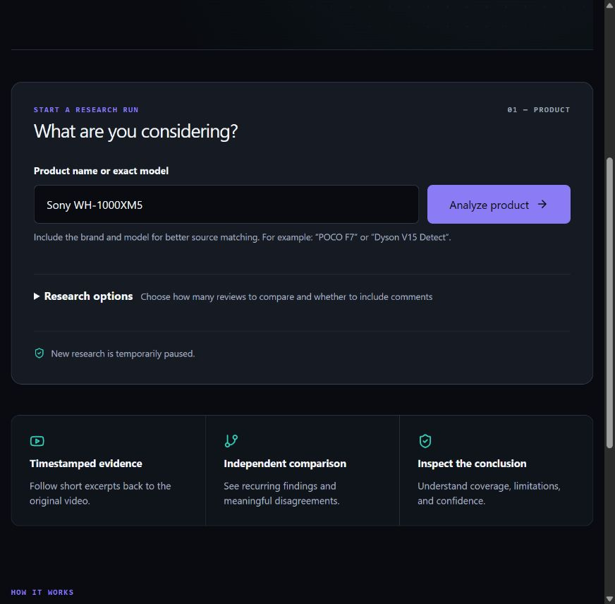
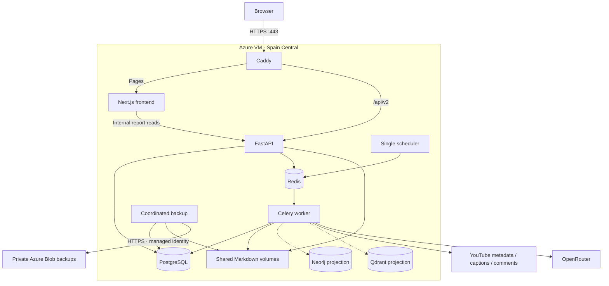

# ReviewLens Azure deployment

[Project overview](README.md) · [Architecture](APP.md) · [User guide](USERS.md) · [Admin guide](ADMIN.md)

**Deployed on October 6, 2026; shut down the same day at the owner's request.** Azure confirmed `PowerState/deallocated` for `vm-reviewlens`. The hosted site and admin control plane are offline. The VM, disks, application data, and private backups are retained for a later restart.

**New research remains paused in the saved configuration:** the first cloud analysis reached YouTube, but caption requests from Azure were blocked. A working caption proxy is needed before opening public research after restart. No successful cloud buying report is claimed here.

**Site:** [ReviewLens on Azure](https://reviewlens-yassir.spaincentral.cloudapp.azure.com) · **Operators:** [Admin sign-in](https://reviewlens-yassir.spaincentral.cloudapp.azure.com/admin/login)

This document records the actual deployment. The earlier [deployment proposal](docs/operations/azure-deployment-plan.md) explains the alternatives and initial estimates.



*Captured before shutdown on October 6. This screenshot records the deployed interface; the hosted site is currently offline.*

## 1. What we deployed

We kept the application's existing topology on one Linux VM, with one `reviewlens` Docker Compose project. Each service has its own container. Caddy provides the public HTTPS entry point.



| Resource | Actual configuration |
|---|---|
| Subscription | Azure for Students |
| Resource group | `rg-reviewlens-demo` |
| Region | `spaincentral` |
| VM | `vm-reviewlens`, `Standard_B2s_v2`, two vCPUs and 8 GiB RAM |
| Operating system | Ubuntu 24.04, x86-64 |
| Disks | 64 GB OS disk and 64 GB data disk, Standard SSD LRS |
| Data mount | `/srv`; Docker data directory `/srv/docker` |
| Public hostname | `reviewlens-yassir.spaincentral.cloudapp.azure.com` |
| Network | `vnet-reviewlens`, `app` subnet, `nsg-reviewlens` |
| Backup storage | `rlbackup3uzrwyhsjq74s`, private `backups` container |
| App source release | `5a10840f173e42e2944a2330d7b7b994a1281419` |
| App image tags | `reviewlens/backend:azure-20261006-2`, `reviewlens/frontend:azure-20261006-2` |

The app uses a fresh production database. Existing local reports, volumes, and administrator sessions were not migrated. The configured administrator's password hash was retained; production does not create the known local test account.

## 2. Deployment sequence

1. Verified Azure authentication, subscription policy, regional quota, and VM availability. Registered `Microsoft.Compute`, `Microsoft.Network`, and `Microsoft.Storage`.
2. Added and validated [Bicep infrastructure](infra/azure/main.bicep), the [host bootstrap](infra/azure/bootstrap.sh), a [production Compose overlay](infra/azure/compose.production.yml), and the [Caddy configuration](infra/azure/Caddyfile).
3. Provisioned the dedicated resource group, VM, network, disks, public DNS name, and private backup storage. The VM's managed identity received Blob Data Contributor access scoped to the backup container.
4. Installed Docker from Docker's official Ubuntu repository. Mounted the data disk at `/srv` and configured persistent Docker volumes there. Docker 29's containerd image layers also consume OS-disk space; both disks need monitoring.
5. Generated separate production database, cache, graph, vector, session, and token-hashing secrets. Copied the required YouTube/OpenRouter credentials and existing administrator password hash into a private production environment file.
6. Created a Git source archive, recorded its SHA-256 and image tags in `release.json`, and transferred it over SSH with a verified host key. Built the backend and frontend images on the VM. No container registry was provisioned.
7. Ran database migrations and configuration seeds, started the services, and refreshed the OpenRouter model/provider catalog without a paid model call.
8. Obtained a valid public TLS certificate through Caddy. Verified HTTPS, readiness, secure anonymous cookies, and protected admin access.
9. Tested a real three-video Sony WH-1000XM5 analysis with comments enabled. Discovery and model dispatch worked; all three caption acquisitions were blocked by YouTube. The app showed a truthful error and published no report. Public admission was paused again.
10. Created the approved private Azure backup, checked every uploaded file's hash, and restored PostgreSQL and Markdown in isolation. Configured the daily backup timer described below.

Two deployment issues were corrected during verification: Docker automatically assigned the proxy's fixed IP to another service, and the initial $0.50 run cap was below the workflow's conservative admission estimate. The overlay now allocates dynamic addresses from `172.31.0.128/25`, leaving Caddy's `172.31.0.2` outside that range. The validated run cap is now $0.80.

## 3. Public networking and secrets

- Only HTTP 80 and HTTPS 443 are published by Compose. Port 80 supports certificate issuance and redirects to HTTPS. SSH 22 is restricted by the Azure firewall to the operator's configured address.
- PostgreSQL, Redis, Neo4j, Qdrant, API 8000, and frontend 3000 have no host port mappings in production.
- `/api/v2` and `/api/v2/*` reach FastAPI without losing the prefix. Other page routes reach Next.js. The frontend uses the public HTTPS origin and `http://api:8000` for internal server-side reads.
- Caddy replaces the forwarded client address. Uvicorn trusts forwarded headers only from Caddy's fixed IP. Streaming responses use immediate flushing.
- `.env.production` is private with mode `0600`; it is excluded from the source archive and Git. SSH private keys and deployment preparation files are also excluded. Secrets are not frontend build arguments.
- Anonymous cookies were verified as Secure, HttpOnly, and SameSite=Lax. The unauthenticated admin API returned HTTP 401. A complete production administrator sign-in/CSRF browser walkthrough has not yet been performed.
- Backup storage disables public blob access and shared-key authorization. Uploads use the VM identity over HTTPS. Backups include the private environment file because restoring report-token hashes and sessions requires the corresponding secrets.

## 4. Research availability and spend limits

| Control | Production setting |
|---|---:|
| Runs per client per hour | 2 |
| Runs per client/session per day | 5 |
| Concurrent public runs per client/session | 1 |
| Queue capacity | 5 |
| Model-spend cap per run | $0.80 |
| Shared public model-spend cap per day | $1.00 |
| Worker / agent concurrency | 2 / 2 |

These are application controls, not Azure billing limits. Admission reserves a conservative amount based on configured limits, retries, and current model prices. At validation time, its estimates were about $0.573 for three reviews with comments and $0.753 for five. Actual usage may be lower. The shared daily reservation can temporarily prevent a second run even when client quotas remain.

### Caption access is the remaining blocker

The first cloud run, `e9b592e3-3586-4049-8fa3-37d667e58efb`, ended after about 28 seconds with zero of three sources analyzed and 5,520 recorded tokens. The source client raised `RequestBlocked`; this was not missing-caption evidence. The transcript library documents cloud-IP blocking and its supported proxy configuration in its [official README](https://github.com/jdepoix/youtube-transcript-api#working-around-ip-bans-requestblocked-or-ipblocked-exception).

The app already supports a private HTTP(S) caption proxy through `YOUTUBE_TRANSCRIPT_PROXY_URL`. A working route has not been supplied or verified. No proxy service was purchased, and no YouTube account cookies were uploaded. Proxy failure logs now omit credentials and endpoint URLs.

Once a route is configured, restart the affected backend services, enable admission using the audited helper below, and repeat the real analysis. Keep admission paused if caption acquisition still fails. A successful buying report, its citations, comment status, PDF export, and completed-run persistence remain required before calling the public research demo fully verified.

## 5. Operating the deployed app

On the VM, define the production Compose command:

```bash
cd /srv/reviewlens/current
dc() {
  sudo docker compose --env-file .env.production \
    -f docker-compose.yml -f infra/azure/compose.production.yml "$@"
}
dc ps
dc logs --tail 100 api worker proxy
dc exec -T api python -m app.cli healthcheck api
```

Use `/health/live` for public liveness. Detailed readiness and infrastructure probes stay inside the VM. The current release is selected by `/srv/reviewlens/current`; prior release directories and image tags are retained.

Pause new public research without deleting runs or reports:

```bash
dc exec -T -e PYTHONPATH=/app api \
  python /opt/reviewlens-operations/activate_public.py --pause
```

After caption access and production configuration have been verified, activate it:

```bash
dc exec -T -e PYTHONPATH=/app api \
  python /opt/reviewlens-operations/activate_public.py
```

The helper uses the existing configuration validation/publication path and records system audit events. It preserves published versions, enforces the $1 daily/$0.80 run limits, and checks three- and five-source admission estimates. The environment gate `PUBLIC_ANALYSIS_ENABLED` must also be true in the running backend processes; changing it requires recreating those services. The persisted active configuration remains paused across restarts until explicitly activated.

### Updating a release

Build from a committed revision. Prepare `release.tar`, `release.json`, and a private `.env.production` with distinct image tags, then upload them into `/srv/reviewlens/releases/<revision>`. `release.json` records the full revision, archive hash, hostname, image tags, and backup account. Run the checked-in [release installer](infra/azure/deploy_release.sh):

```bash
sudo bash /srv/reviewlens/releases/<revision>/deploy_release.sh \
  /srv/reviewlens/releases/<revision>
```

It verifies the archive, builds images, runs migrations/seeds, waits for service health, and updates the current symlink only after success. Run deployment during a maintenance window: building on this two-vCPU VM and replacing services can interrupt requests. New application code does not automatically replace a pinned production workflow; publish and activate intended configuration changes separately.

For infrastructure changes, validate `infra/azure/main.bicep` before applying a group deployment with the private parameter file. That file supplies the SSH public key, operator address, and bootstrap text. Do not publish it or replace production secrets with local `.env` values. Update the SSH firewall rule through Azure when the operator's address changes; retain host-key verification.

## 6. Backups and recovery

The [backup coordinator](infra/azure/backup.sh) pauses API/worker/scheduler writers, exports PostgreSQL and both Markdown volumes, includes `release.json` and the private production environment, hashes the files, resumes writers, and uploads the snapshot using [managed identity](infra/azure/upload_backup.py). Redis queues and Neo4j/Qdrant projection databases are not included as authoritative backup data. Projection recovery follows the [recovery runbook](docs/operations/phase10-runbook.md).

The systemd [service](infra/azure/reviewlens-backup.service) and [timer](infra/azure/reviewlens-backup.timer) are configured for daily backups at **03:00 UTC** (04:00 Casablanca on the deployment date). They cannot run while the VM is deallocated. The timer remains enabled and is configured to catch up on missed schedules after restart; check its journal when bringing the server back online. This backup briefly interrupts backend requests.

```bash
sudo systemctl status reviewlens-backup.timer
sudo systemctl start reviewlens-backup.service
sudo journalctl -u reviewlens-backup.service --since '1 day ago'
```

The first verified snapshot was `20261006T033755Z`. All six offsite files matched their local SHA-256 hashes. Its isolated restore recovered one analysis run, 21 context-node versions, one administrator, and 21 Markdown files. The verification database had no network and used temporary storage; it never overwrote production. The paired PostgreSQL/Markdown restore is verified, but a complete VM rebuild and projection reconstruction have not been rehearsed.

The scheduled backup service was also run manually against the final release. Snapshot `20261006T034454Z` completed with systemd `Result=success` and exit status zero; backend health recovered before the upload finished. The subsequent VM shutdown suspends future scheduled backups until restart.

For recovery: obtain the paired snapshot and its secret environment through approved private access, verify `SHA256SUMS`, restore PostgreSQL and both Markdown roots together while writers are stopped, apply compatible images, then reconstruct projections and verify readiness and report links. Keep secrets and database dumps out of Git and public screenshots.

Azure Blob soft delete is configured for 14 days. It is a recovery window for deletions, **not an expiry policy**. Local and offsite backups currently accumulate; review retention and disk usage. Backup failures are visible in the systemd journal; no email alert integration is configured.

## 7. Cost and operating limits

The previously checked Spain Central Linux retail compute rate was $0.0912/hour, approximately **$66.58 for 730 running hours**. This excludes disks, public IP, backups, bandwidth, taxes, and model/proxy services. See the [dated price lookup and sources](docs/operations/azure-deployment-plan.md#3-cost-and-availability). Remaining student credit has not been verified, and no Azure budget alert or shutdown schedule is configured.

The VM is currently **stopped and deallocated**. We ran the deallocation command and verified its final power state through Azure's instance view. Compute allocation charges stop in this state. These commands stop or restart the retained deployment:

```bash
az vm deallocate --resource-group rg-reviewlens-demo --name vm-reviewlens
az vm start --resource-group rg-reviewlens-demo --name vm-reviewlens
az vm get-instance-view --resource-group rg-reviewlens-demo --name vm-reviewlens \
  --query "instanceView.statuses[?starts_with(code, 'PowerState/')].displayStatus" --output tsv
```

Disks and other retained resources can still incur charges while the VM is deallocated. [Azure VM states and billing](https://learn.microsoft.com/en-us/azure/virtual-machines/states-billing).

After a manual restart, wait for service readiness and inspect the backup timer before using the hosted app. Public research stays paused until caption access is fixed and explicitly activated. No automatic VM restart is configured.

This is a single-host portfolio deployment. It has no failover or load benchmark, and sustained CPU use can exhaust B-series credits. No rollback rehearsal, completed cloud report/PDF check, or production admin browser walkthrough is claimed. Before wider use, resolve caption access, confirm credit and operating budget, monitor backups, and verify the remaining application flows.

## 8. Recorded verification

The application checks below were recorded while the VM was running, before the requested shutdown.

| Check | Result |
|---|---|
| Backend suite before deployment | 595 tests passed |
| Focused transcript/proxy privacy tests after the fix | 25 tests passed |
| Context/link audit and Git whitespace checks | Passed |
| Bicep compilation and Azure template validation | Passed; provisioning succeeded |
| Frontend/backend container builds | Completed |
| Public HTTPS home and API liveness | HTTP 200; certificate validation passed |
| PostgreSQL, Redis, Markdown, Neo4j, Qdrant | Ready |
| Public database/application ports | No production host mappings; only proxy 80/443 published |
| Secure anonymous cookie / unauthenticated admin | Passed / HTTP 401 |
| Real analysis and reload of progress page | Run started; committed progress/error recovered after reload |
| Complete buying report / PDF | Blocked by YouTube caption access |
| Private Blob backup / isolated paired restore | Passed |
| Requested Azure shutdown | Confirmed `PowerState/deallocated` on October 6, 2026; hosted app offline |

