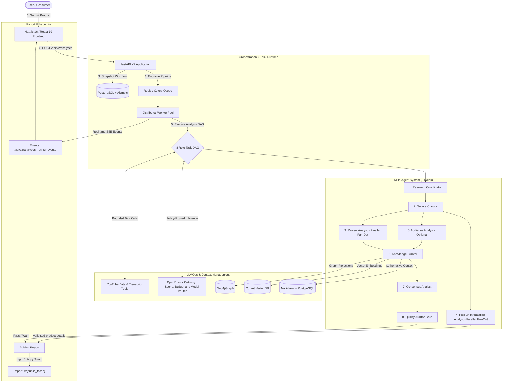

# ReviewLens — Evidence-Backed Product Research

<div align="center">

[](#-llmops--control-plane)
[](#-multi-agent-system-architecture)
[](#product-information-card)
[](#-hybrid-storage--knowledge-graph)

[](https://nextjs.org/)
[](https://fastapi.tiangolo.com/)
[](https://www.postgresql.org/)
[](https://docs.celeryq.dev/)
[](https://www.docker.com/)
[](https://python.org)
[](https://www.typescriptlang.org/)
[](#-acceptance-gates--verification)

**Turn hours of conflicting, noisy YouTube product reviews into structured, evidence-linked buying reports.**

[Quick Start](#-quick-start) • [Product Card](#product-information-card) • [Architecture](#-system-architecture) • [Multi-Agent DAG](#-multi-agent-system-architecture) • [LLMOps](#-llmops--control-plane) • [Verification](#-acceptance-gates--verification) • [Documentation](#documentation)

</div>

---

## 📌 Repository Topics (GitHub Tags)

The repository uses these six GitHub topics to describe the implemented system:

```text
llmops  multi-agent-systems  knowledge-graph  rag  dag  fastapi
```

---

## 💡 Overview

**ReviewLens** is a full-stack, evidence-grounded research engine that converts multiple long-form YouTube video reviews into a durable buying recommendation.

The V2 research experience is the only runtime: `/` accepts research requests, `/analysis/{run_id}` shows owner progress, `/r/{public_token}` serves unlisted reports, and `/admin` hosts the protected operations cockpit. `/research` permanently redirects to `/`.

The legacy V1 UI, provider selection, direct provider clients, `/api/config`, `/api/analyze`, `/api/analyze/stream`, and `GET /health` have been retired. Historical compatibility requests and Phase 11 cutover observations remain in PostgreSQL as immutable operational history.

### Core Distinctions
- **Strict Evidence Gating:** Every pro, con, sentiment score, and verdict links directly to immutable, timestamped transcript nodes. Unsubstantiated claims are rejected by an automated Quality Auditor.
- **Deterministic 8-Agent DAG:** Replaces uncontrolled recursive agent loops with a bounded directed acyclic graph. Each agent has strict capability boundaries, schema contracts, and single-cycle correction rules.
- **Product Information Card:** An agent selects useful attributes for the researched product category, validates each value against YouTube titles, descriptions, or timestamped transcripts, and separates listed options from each reviewer's stated sample. The card appears during research, in the published report, and in the PDF.
- **Hybrid Context & Knowledge Graph:** PostgreSQL manages transactional records, portable Markdown files store readable node bodies, and Neo4j + Qdrant act as rebuildable graph topology and semantic vector retrieval projections.
- **Production LLMOps Control Plane:** OpenRouter gateway with policy routing, token spend attribution, budget caps, rate limits, and an administrative operations cockpit.

### Product Information Card

For each selected video, the **Product Information Analyst** chooses attribute groups that fit the researched product. A camera might yield optics and sensor details; headphones might yield battery and connectivity details. There are no category-specific fields to fill. Each displayed fact and listed variant option links to the exact video title, description, or timestamped transcript passage that supports it. Conflicting review statements keep their separate citations.

Each video card also shows only the reviewer's stated sample details. Missing configuration is labeled **Unconfirmed**; a manufacturer's or another reviewer's options are never treated as that reviewer's unit. Validated facts appear on the live progress page, remain in the published report, and are included in the PDF. Extraction failure leaves the existing review report publishable. This release uses stored YouTube evidence only; official product-page retrieval is deferred.

---

## 🏛️ System Architecture



---

## 🤖 Multi-Agent System Architecture

The analysis pipeline executes a deterministic 8-agent DAG with strict separation of concerns and negative capabilities:

| # | Role | Core Responsibility | Allowed Tools | Invariant Prohibitions |
|---|---|---|---|---|
| **1** | **Research Coordinator** | Converts product requests into targeted YouTube search plans and exclusion rules. | Structured plan generation | Cannot call external APIs or create arbitrary tasks. |
| **2** | **Source Curator** | Scores discovered videos for relevance, review intent, sponsor bias, and Shorts filtering. | YouTube metadata, graph deduplication | Cannot analyze product verdict or fetch arbitrary URLs. |
| **3** | **Review Analyst** | Analyzes one selected video transcript in parallel fan-out; extracts claims with timestamps. | Graph retrieval, transcript reader, evidence validator | Cannot use outside world knowledge or cross-source data. |
| **4** | **Product Information Analyst** | Extracts category-relevant facts, explicitly listed options, and stated sample details from one selected video's stored evidence. | Bounded source and transcript context | Cannot fetch URLs or infer unstated variants or sample details. |
| **5** | **Audience Analyst** | Assesses YouTube comments as secondary signals for recurring sentiment and user issues. | Comment reader, source nodes | Inactive if comments disabled; cannot override video evidence. |
| **6** | **Knowledge Curator** | Normalizes findings into a typed evidence graph with support and contradiction edges. | Graph read/write, vector upsert, evidence validator | Cannot alter source transcript nodes or omit contradictions. |
| **7** | **Consensus Analyst** | Synthesizes multi-source findings into final score, pros/cons, fit, and avoidance guidance. | Graph & vector retrieval, consensus calculator | Cannot read unselected transcripts or suppress dissenting reviews. |
| **8** | **Quality Auditor** | Formally validates every claim against linked evidence nodes before authorizing publication. | Graph traversal, evidence validator, schema validator | Cannot silently rewrite reports; rejects ungrounded drafts. |

### Single-Cycle Schema Correction
When an agent produces an invalid schema or broken evidence link, the orchestrator triggers exactly **one bounded correction attempt**. The correction task receives only the invalid output plus validator issues, preventing runaway loops and preserving token budgets.

---

## 📊 LLMOps & Control Plane

ReviewLens provides a native LLMOps suite for enterprise observability, spend control, and model governance:

- **OpenRouter Routing Gateway:** Policy-driven routing with automatic fallbacks. Production defaults to `deepseek/deepseek-v4-flash` and `deepseek/deepseek-v4-flash-0731`.
- **Exact Usage Attribution:** Every inference call records input tokens, output tokens, reasoning tokens, and dollar cost attributed to `run_id`, `task_id`, `agent_version`, and `model_policy_version`.
- **Budget Caps & Circuit Breakers:** Configurable per-run token limits, per-workflow spend caps, and hard circuit breakers on budget breaches.
- **Immutable Versioning:** Workflows, agent prompts, and routing policies are snapshotted on run creation. Modifying a published agent configuration generates a new draft successor.
- **Admin Cockpit (`/admin`):** Protected administrative interface featuring CSRF protection, signed sessions, model management, real-time health checks, audit logs, and graph inspection.

---

## 🔌 Typed Tools and Bounded Context

ReviewLens uses its own versioned tool registry and source-grounded context retrieval:

- **Decoupled Tool Contracts:** Tools (YouTube metadata search, transcript extraction, comment filtering, evidence validation) follow standardized, typed input/output schemas.
- **Bounded Context Slices:** Agents receive structured context slices retrieved from the knowledge graph rather than raw, noisy prompt stuffing.
- **Integration Boundary:** An MCP client or server bridge could be added later. The current runtime calls the internal registry; it does not implement MCP transport.

---

## 🧠 Hybrid Storage & Knowledge Graph

ReviewLens decouples transactional records, human readability, and retrieval into specialized storage layers:

```text
┌────────────────────────────────────────────────────────┐
│               Authoritative Truth                      │
├───────────────────────────┬────────────────────────────┤
│   PostgreSQL + Alembic    │     Versioned Markdown     │
│   - Transactions          │     - Human-readable nodes │
│   - Run & Task states     │     - Obsidian vault notes │
│   - Budgets & LLMOps data │     - Evidence node bodies │
└─────────────┬─────────────┴─────────────┬──────────────┘
              │ Rebuildable Projections   │
              ▼                           ▼
┌───────────────────────────┐ ┌──────────────────────────┐
│        Neo4j Graph        │ │     Qdrant Vector DB     │
│  - Support/contradiction  │ │  - Semantic search       │
│  - Claim derivation graph │ │  - Dense embeddings      │
└───────────────────────────┘ └──────────────────────────┘
```

---

## 🛠️ Tech Stack

| Domain | Technology | Purpose |
|---|---|---|
| **Frontend** | [Next.js 16](https://nextjs.org/) & [React 19](https://react.dev/) | App router, Server Components, interactive evidence graph, admin console |
| **Backend** | [FastAPI](https://fastapi.tiangolo.com/) & [Python 3.12](https://python.org) | Async V2 API, strict Pydantic v2 validation, SSE streaming, security |
| **Orchestration** | [Redis](https://redis.io/) & [Celery](https://docs.celeryq.dev/) | Distributed queue, task DAG scheduling, leases, retry handling |
| **Relational DB** | [PostgreSQL 17](https://www.postgresql.org/) & [Alembic](https://alembic.sqlalchemy.org/) | Authoritative runs, snapshots, configurations, token accounting, audit logs |
| **Graph DB** | [Neo4j](https://neo4j.com/) | Rebuildable projection of evidence nodes, support, contradiction, derivation |
| **Vector DB** | [Qdrant](https://qdrant.tech/) | Dense embeddings index for fast semantic context retrieval |
| **LLM Gateway** | [OpenRouter](https://openrouter.ai/) | Multi-model routing, unified inference, token spend reconciliation |
| **Containerization** | [Docker Compose](https://www.docker.com/) | Reproducible multi-service deployment with isolated testing environments |
| **Testing** | [Playwright](https://playwright.dev/) & [pytest](https://pytest.org/) | End-to-end browser flows, unit suites, mock inference harness |

---

## 🚀 Quick Start

### 1. Prerequisites
- Docker Engine 24+ & Docker Compose v2+
- Python 3.12+
- Node.js 20+ (for local frontend development)

### 2. Configure Environment
Copy `.env.example` to `.env`, set the required infrastructure and server-side credentials, then generate the admin password hash:

```bash
cd backend
python -m venv .venv

# Windows (PowerShell):
.venv\Scripts\activate
# macOS/Linux:
# source .venv/bin/activate

pip install -r requirements.txt -r requirements-dev.txt
python -m app.cli hash-password
cd ..
```

### 3. Start the Stack
Launch the full stack with Docker Compose:

```bash
docker compose up --build --wait
```

If YouTube rate-limits caption requests from the worker (HTTP 429), research cannot use those transcripts. The run now reports this as a caption access problem and counts only sources that were actually analyzed. An operator can set the optional server-only `YOUTUBE_TRANSCRIPT_PROXY_URL` in the private `.env` file to use an unblocked HTTP(S) proxy for captions, then recreate the worker. Keep proxy credentials out of Git and logs.

### 4. Refresh the Model Catalog
The Compose migration service seeds the published workflow. With OpenRouter credentials configured, refresh the catalog before accepting submissions. The seed command is safe to rerun after a workflow update:

```bash
docker compose exec -T api python -m app.cli openrouter-catalog-refresh
docker compose exec -T api python -m app.cli analysis-config-seed
```

### 5. Access Interfaces

| Interface | URL | Description |
|---|---|---|
| **Public Research UI** | [http://localhost:3000](http://localhost:3000) | Submit research queries and view live buying reports |
| **Admin Cockpit** | [http://localhost:3000/admin](http://localhost:3000/admin) | Protected operations cockpit (agents, models, budgets, traces) |
| **API Documentation** | [http://localhost:8000/docs](http://localhost:8000/docs) | Interactive Swagger / OpenAPI documentation |
| **Health Probes** | `http://localhost:8000/health/live` | Process liveness and readiness endpoints |

---

## 🔐 Optional Production Retirement Authorization

Export evidence only from the authoritative production database after a passed non-test Phase 11 observation, the 24 hour compatibility quiet period, reconciled usage, no budget breach, and operator migration attestation:

```bash
cd backend
python -m app.cli phase12-export-cutover-evidence \
  --observation-id OBSERVATION_UUID \
  --attestation-reference change/REFERENCE \
  --output ../docs/release-evidence/phase12-cutover.json
```

The artifact stores sanitized aggregates and a canonical SHA-256 digest. See [the Phase 12 runbook](./docs/operations/phase12-retirement.md).

---

## 🧪 Acceptance Gates & Verification

The current gate replaces superseded per-phase checkers:

```bash
# Run static quality & contract checks
python scripts/check_phase12.py --static-only

# Run isolated container stack tests with local OpenRouter mock
python scripts/check_phase12.py --stack-only

# Run browser acceptance tests via Playwright
python scripts/check_phase12.py --browser-only

# Execute the complete production gate (static, stack, browser)
python scripts/check_phase12.py --full

# Validate production retirement authorization when deployed over Phase 11
python scripts/check_phase12.py --evidence-only
```

`--full` is the complete working-project gate: static checks, the isolated stack, and browser acceptance. The separate `--evidence-only` mode validates production retirement authorization when ReviewLens is deployed over a real Phase 11 installation; it is not required for local development or repository CI.

The stack gate creates isolated credentials and storage, migrates from empty state, cycles migration `20260920_0009`, runs backup and recovery drills, executes the complete backend and browser suites, and inspects mock history. It fails on a live provider endpoint, secret exposure, or inference outside the two approved Flash slugs, and always removes its generated environment, containers, volumes, and reports.

---

## Documentation

The local `context/` vault is intentionally Git-ignored. Start locally with `context/00_INDEX_AND_PROJECT_OVERVIEW.md` and `context/codebase/00_CODEBASE_MAP.md`. The public specification and test mapping is [Phase 12 conformance](./docs/release-evidence/phase12-conformance.md).

Validate the local context vault with:

```bash
python scripts/check_context.py
```
