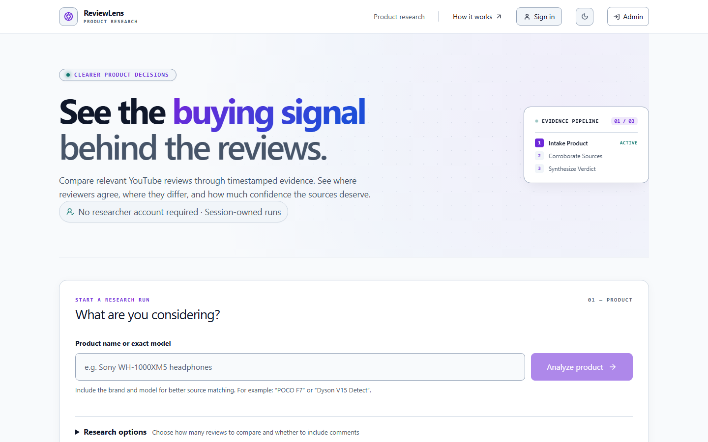
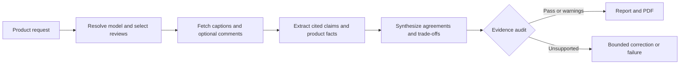

# ReviewLens

**Product research you can trace back to the review.**

ReviewLens compares selected YouTube product reviews and turns them into a buying report with linked source evidence. It surfaces agreements, disagreements, product details, and uncertainty so a reader can check *why* a recommendation was made.

**Full-stack project:** Next.js, FastAPI, PostgreSQL, Redis/Celery, OpenRouter, Neo4j, and Qdrant. The application runs locally with Docker Compose.

[User guide](USERS.md) · [Admin guide](ADMIN.md) · [App walkthrough & architecture](APP.md) · [Deployment](DEPLOYMENT.md) · [Real example](USERS.md#worked-example-sony-wh-1000xm5)

**Hosted preview:** [ReviewLens on Azure](https://reviewlens-yassir.spaincentral.cloudapp.azure.com). The HTTPS deployment is running; new cloud research is paused while YouTube caption access is configured. See the [deployment status and verified checks](DEPLOYMENT.md).

[See how it works](#how-it-works) · [Engineering decisions](#engineering-decisions) · [Run locally](#run-locally) · [Verification](#verification)



## What the app does

1. Enter a product model. If the name is ambiguous, ReviewLens asks for clarification before analyzing the selected videos.
2. Choose how many reviews to analyze (three to five) and optionally include viewer comments. The app selects relevant videos and shows progress while the research runs.
3. Read a report with cited strengths, drawbacks, differences between reviewers, and a confidence-aware buying verdict. Open the source video at the cited timestamp to inspect a claim.
4. Explore available evidence-backed specifications and stated reviewer configurations. Share the unlisted report or export it as a PDF.

Comments remain a secondary signal. If comments or some product details cannot be validated, the report explains the gap and can still publish from the verified video evidence.

## Engineering decisions

| Challenge | Design choice | Why it matters |
|---|---|---|
| **AI can sound certain without enough evidence.** | Review claims bind to stored quotation nodes. A separate audit checks material details and source ownership before publication. Unsupported findings are removed or the report is blocked. | Readers can inspect the evidence; a polished answer alone cannot pass the gate. |
| **A multi-minute analysis can fail midway.** | A versioned task graph stores runs, attempts, deadlines, outputs, and model usage in PostgreSQL. Redis/Celery executes the work; retries preserve earlier artifacts and stay inside the run budget. | Progress survives disconnects and failures are diagnosable without starting every stage over. |
| **Products do not share one specification template.** | Extraction proposes short, atomic attributes, then code validates each value and citation. Variant options and a reviewer's actual sample stay separate. | The same pipeline can describe headphones, phones, and laptops without inventing a fixed set of fields. |

The workflow also uses bounded model calls, policy-based routing, token and cost accounting, and an admin cockpit for inspecting runs and configuration. Model outputs are proposals: deterministic code owns identity, citation checks, scores, budgets, and publication rules.

## How it works


```mermaid
flowchart LR
    A[Product request] --> B[Resolve model and select reviews]
    B --> C[Fetch captions and optional comments]
    C --> D[Extract cited claims and product facts]
    D --> E[Synthesize agreements and trade-offs]
    E --> F{Evidence audit}
    F -->|Pass or warnings| G[Report and PDF]
    F -->|Unsupported| H[Bounded correction or failure]
```

The public UI is built with Next.js. FastAPI admits requests through `/api/v2`, snapshots the active workflow, and exposes progress through resumable events. PostgreSQL is the source of truth for runs and evidence metadata; readable node bodies live in versioned Markdown. Neo4j and Qdrant are rebuildable graph and vector projections. OpenRouter is the server-side model gateway.

For illustrated usage instructions, read the [user guide](USERS.md) and [admin guide](ADMIN.md). For architecture diagrams and a guide to the implementation, read [Inside ReviewLens](APP.md). The [Phase 12 contract map](docs/release-evidence/phase12-conformance.md) and [two-product audit case study](docs/release-evidence/two-product-audit-verification.md) provide verification evidence.

## Run locally

**Requirements:** Docker Desktop or Docker Engine with Compose, a YouTube API key, and an OpenRouter key. Keep credentials in a private `.env` file; use [`.env.example`](.env.example) as the checklist.

1. Copy `.env.example` to `.env` and fill in its required server-side values. Generate the admin password hash with `python -m app.cli hash-password` from an installed backend environment.
2. On Windows, run `.\scripts\run-local.ps1` in PowerShell. It checks configuration, starts the stack, refreshes the model catalog, and verifies readiness.
3. On macOS or Linux, start the stack and seed the catalog and workflow:

   ```bash
   docker compose up --build --wait
   docker compose exec -T api python -m app.cli openrouter-catalog-refresh
   docker compose exec -T api python -m app.cli analysis-config-seed
   ```

Open [http://localhost:3000](http://localhost:3000) for research, [http://localhost:3000/admin](http://localhost:3000/admin) for the protected cockpit, or [http://localhost:8000/docs](http://localhost:8000/docs) for the API. The readiness probe is `/health/ready` on port 8000.

Docker Desktop groups the app under **reviewlens**. This is one Compose project with eight running service containers and a migration container that exits after setup. Acceptance tests use separate temporary projects. The [Azure deployment guide](DEPLOYMENT.md) records the hosted topology, HTTPS, release process, backups, and current availability.

## Verification

The repository includes backend contract and failure tests, mocked YouTube and OpenRouter upstreams, browser tests, and an isolated Compose acceptance stack. The local static gate runs backend tests, frontend lint/unit/build checks, dependency audits, and the documentation link audit:

```bash
python scripts/check_phase12.py --static-only
```

For the isolated stack and browser flows, use `--stack-only` and `--browser-only`; `--full` runs the complete gate. The latest local static check passed with **592 backend tests** and **18 frontend unit tests**. The 66 backend integration tests require the isolated stack and are skipped by the static command. No paid model calls are made by the static gate.

CI configuration is in [`.github/workflows/phase12-acceptance.yml`](.github/workflows/phase12-acceptance.yml). The [release evidence](docs/release-evidence/) records specific live and fixture results, including failures that informed later fixes.

## Current limits

- Analysis depends on accessible YouTube captions. A rate limit or missing transcript can reduce source coverage.
- Model judgments vary. The audit and deterministic checks reduce unsupported claims, but a valid detail can still be omitted; warnings show when evidence or coverage is limited.
- Product facts come from selected video titles, descriptions, and transcripts. ReviewLens does not yet verify specifications against manufacturer pages.
- Comment analysis uses a bounded sample and never overrides the reviewed video evidence.

ReviewLens is an active engineering project. The repository documents what the system verifies, where it degrades, and which results remain unproven across a broad range of products.

<details>
<summary>Repository navigation and runtime status</summary>

The V2 research experience is the only runtime. The legacy V1 UI and API contracts are retired; `/research` permanently redirects to `/`, and product APIs use `/api/v2`.

[APP.md](APP.md) is the application and architecture guide, including the runtime and migration boundary and links to the implementation. [USERS.md](USERS.md) and [ADMIN.md](ADMIN.md) explain the public and operator workflows with screenshots from a real analysis.

The local specification vault starts at `context/00_INDEX_AND_PROJECT_OVERVIEW.md`, with implementation maps under `context/codebase/00_CODEBASE_MAP.md`. The `context/` directory is excluded from version control; the published guides above provide navigation for this GitHub repository.

Deploying over an existing Phase 11 environment requires an authoritative `docs/release-evidence/phase12-cutover.json` export and the evidence gate described in the [retirement runbook](docs/operations/phase12-retirement.md). Local development does not require that production artifact.

</details>
