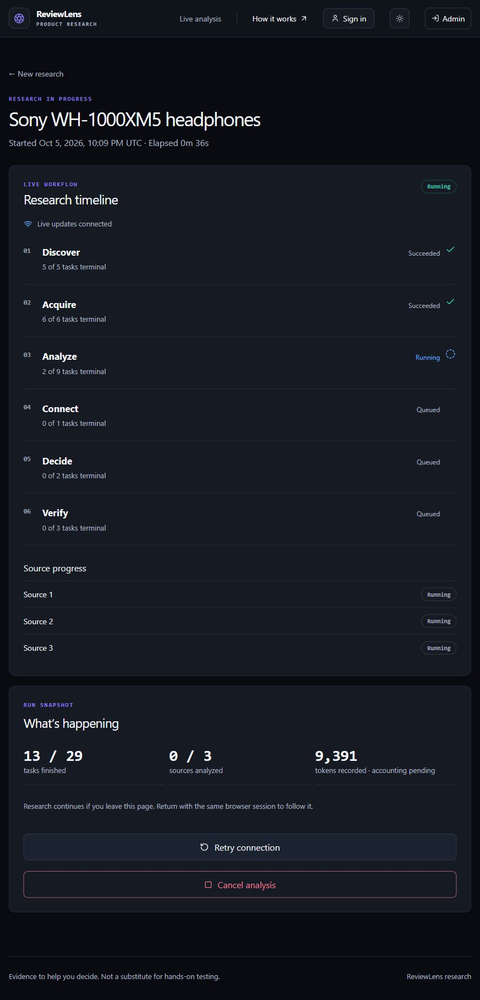
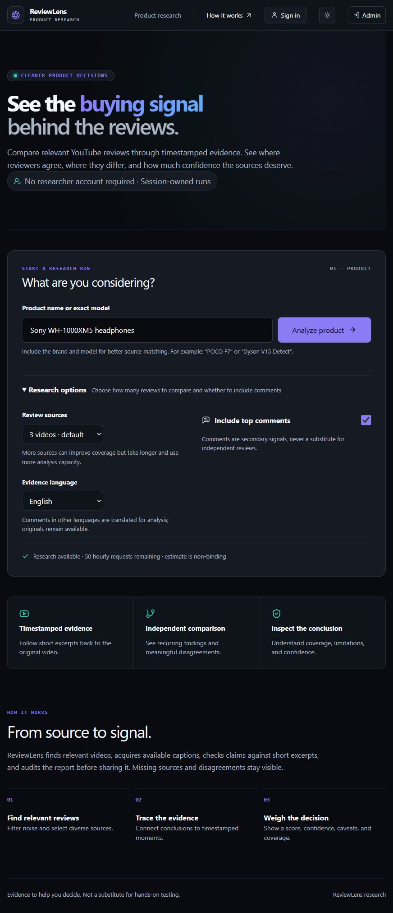
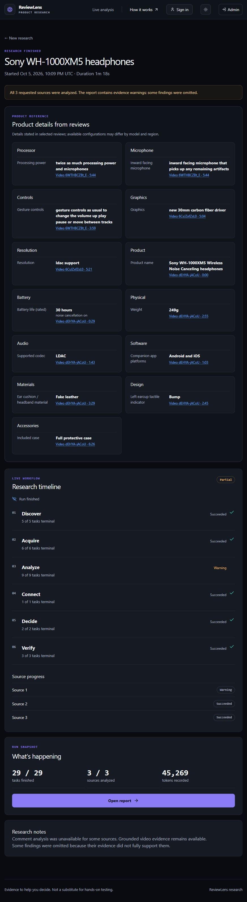
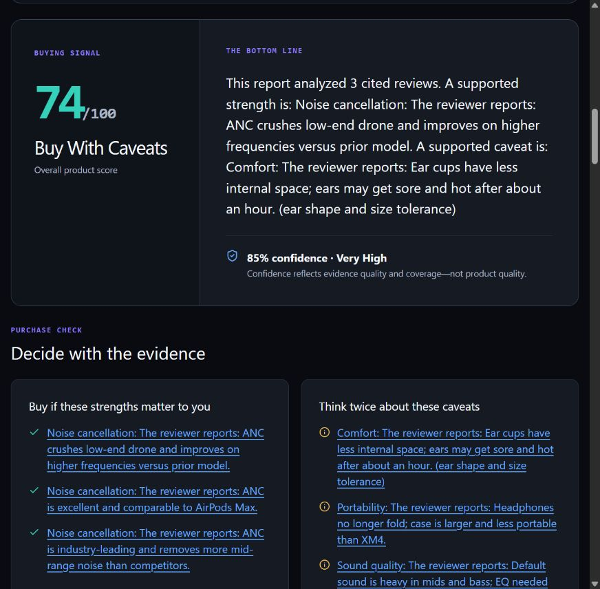
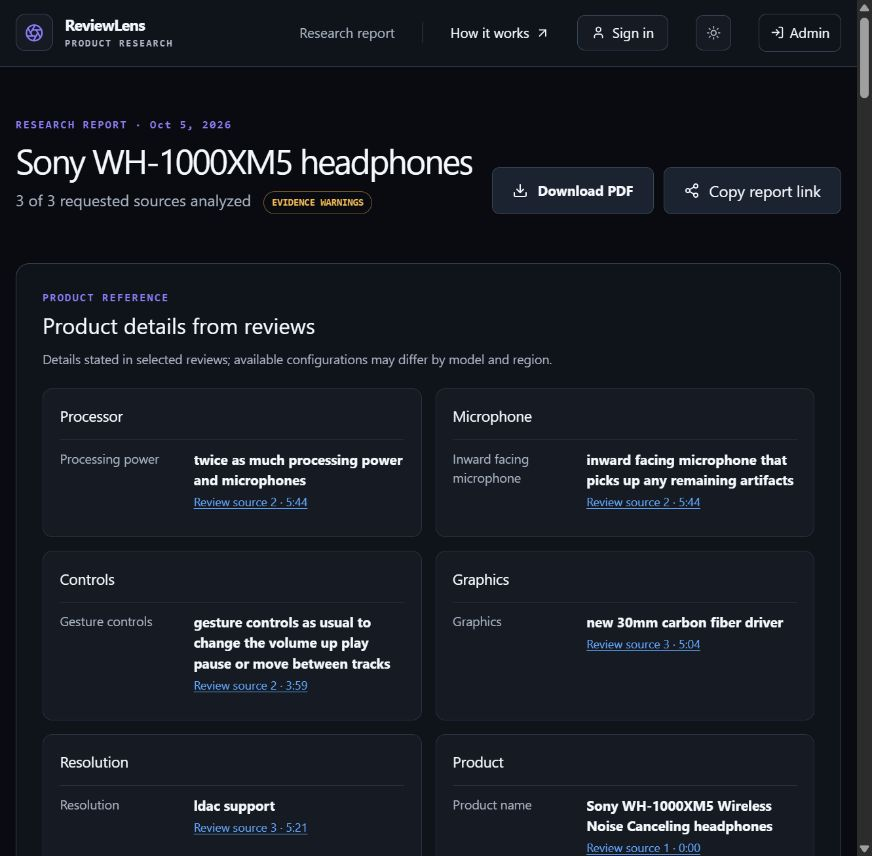
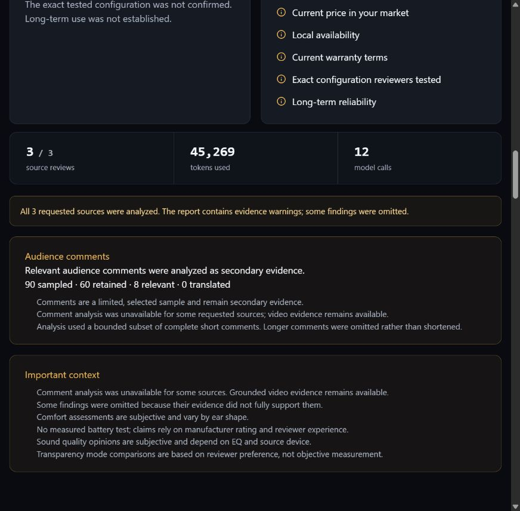
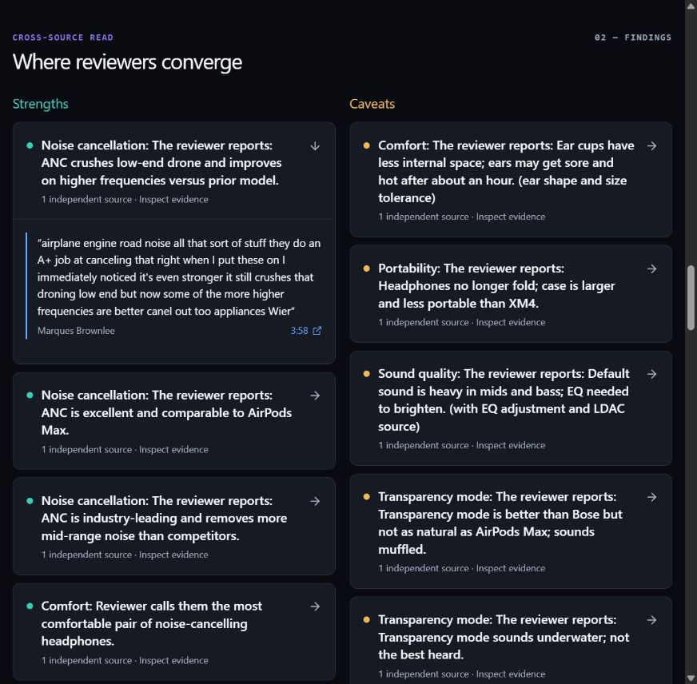
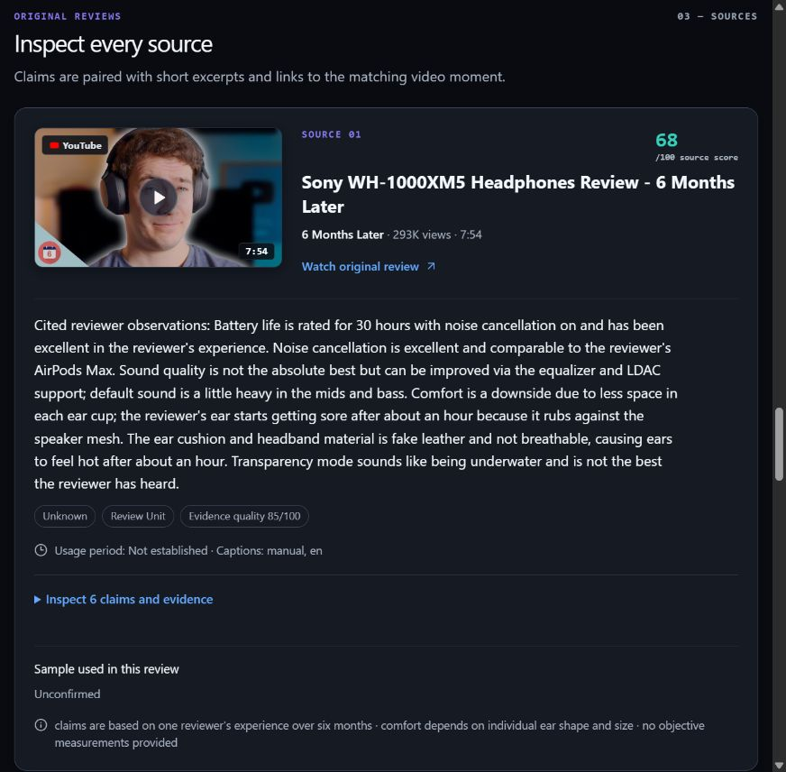
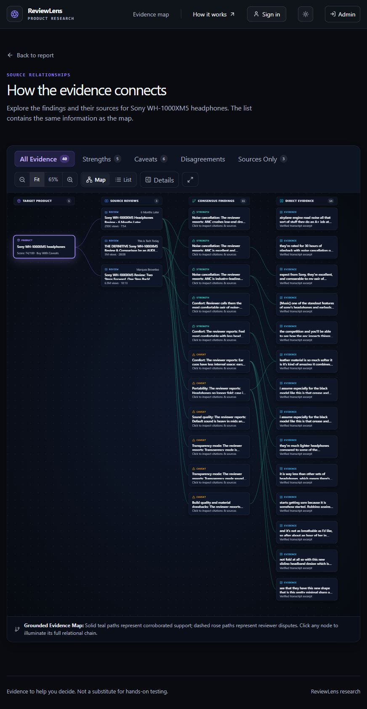
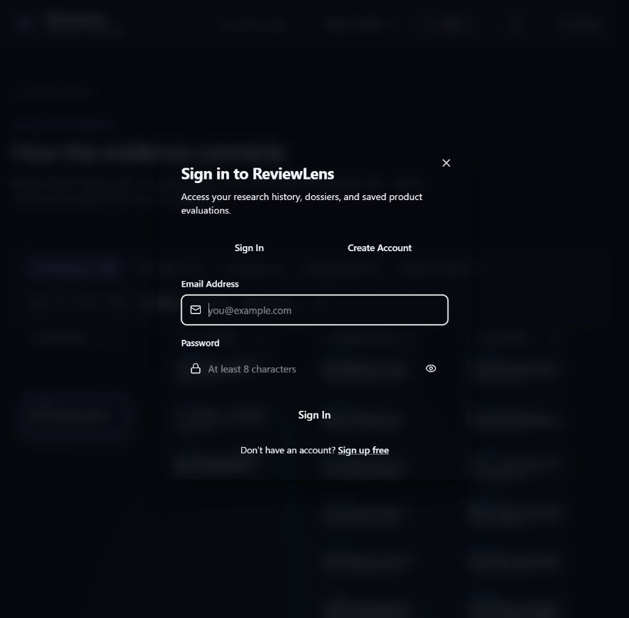

# ReviewLens user guide

**Research a product, inspect the evidence, and keep the report.**

[Project overview](README.md) · [Architecture](APP.md) · [Admin guide](ADMIN.md)

This guide covers the public research app. Start at [http://localhost:3000](http://localhost:3000) after following the [local setup instructions](README.md#run-locally).

The screenshots show the running local app and a real **Sony WH-1000XM5 headphones** analysis. Pages were captured after their content loaded; the review thumbnails were loaded before capturing the source cards. These are recorded results from one run, and a new analysis can return different sources, findings, and scores.

## What you can do

| Capability | Where to use it |
|---|---|
| Research a named product | Home page |
| Choose review count, comments, and evidence language | **Research options** |
| Confirm an ambiguous model | Intake clarification or the progress page |
| Follow progress and cancel your active run | Analysis page |
| Read the verdict, confidence, and purchase caveats | Report |
| Inspect product details and the reviewer's tested configuration | Report product card and source cards |
| Open a quotation at its YouTube timestamp | Finding or source evidence |
| Explore connections between findings and sources | Evidence map or its list view |
| Share a report and download its PDF | Report header |
| Keep account-linked research history | Optional sign-in and **My Researches** |

## Worked example: Sony WH-1000XM5

To follow the same journey:

1. Enter **Sony WH-1000XM5 headphones** in the [research form](#1-start-a-research-run).
2. Choose **3 videos**, enable **Include top comments**, and leave the evidence language as **English**.
3. Press **Analyze product** and follow the [live timeline](#2-follow-progress).
4. When **Open report** appears, read the [verdict and coverage](#3-read-the-report).
5. Expand the noise-cancellation finding and inspect Marques Brownlee's cited quotation at **3:58**, as shown in [Check a finding](#4-check-a-finding-against-the-source).
6. Review the comment limitations, inspect the [evidence map](#5-explore-the-evidence-map), and copy the report link or download its PDF.

*This is the active research screen from the same run that produced the report below.*

| Recorded result | This example |
|---|---|
| Review coverage | **3 of 3** requested sources analyzed |
| Duration | **1 minute 18 seconds** |
| Buying verdict | **Buy With Caveats**, **74/100** |
| Evidence confidence | **85%**, displayed separately from the product score |
| Cited details | Includes a 30-hour ANC-on battery rating, 249 g weight, and LDAC support |
| Audience sample | **90 sampled · 60 retained · 8 relevant · 0 translated** |
| Publication status | **Evidence warnings**: some findings were omitted, and comment analysis was unavailable for one source |

The selected reviews were from **6 Months Later**, **This is Tech Today**, and **Marques Brownlee**. The report presents supported ANC strengths alongside comfort, portability, and other caveats. All three videos were analyzed, while the warnings still limit what the report can establish. It did not confirm an exact tested configuration or a long-term use period.

You can open the [recorded example report](http://localhost:3000/r/YVt5I42rpaRBDMBF8DiJSgRileLE7P9wzAKjzGeeDJA) while this local database and report token remain available. That URL belongs to this installation; the screenshots remain viewable on GitHub without running the app. The [admin guide](ADMIN.md#worked-example-inspect-the-same-sony-run) follows the same run behind the scenes.

## 1. Start a research run

1. Enter the brand and exact model in **Product name or exact model**. For example, use `Sony WH-1000XM5` rather than just `Sony headphones`.
2. Open **Research options** if you want to change the defaults.
3. Choose **3, 4, or 5 videos** under **Review sources**. Three is the default; more sources use more analysis capacity and can take longer.
4. Enable **Include top comments** if you want a secondary audience signal. It is off by default.
5. Select **English** or **French** under **Evidence language**. This controls the requested language for evidence/comment processing; it does not guarantee that every original review uses that language.
6. Read the availability message, then press **Analyze product**.

*The example requests three reviews, enables comments, and uses English. The availability check has completed.*

An availability check runs before research begins. If your quota is exhausted or capacity is temporarily unavailable, the app keeps the entered product and explains when it can check again. An estimate is guidance rather than a guaranteed final token count or completion time.

### If the app asks which product you mean

For an incomplete name, refine the model or use the explicit confirmation offered by the intake. After confirming, press **Analyze product** to submit.

An admitted run can also pause with a product question based on discovered videos. Read the choices and supporting source links, select the intended model, and confirm the choice to resume. The question stays attached to the run across refreshes. To research a different model outside those choices, use the provided change-model flow to return to the intake.

## 2. Follow progress

The analysis page groups real work into **Discover**, **Acquire**, **Analyze**, **Connect**, **Decide**, and **Verify**. It shows task states, source progress, elapsed time or duration, and recorded token use. Cited product details can appear as soon as they are available.

*The finished Sony run shows all 29 tasks terminal, all three sources analyzed, and the **Open report** action. Its warnings remain visible.*

- Keep the analysis URL to return to the run in the same browser session.
- If the connection drops, look for the reconnecting or polling message. Background work continues; **Retry connection** refreshes the connection to the run.
- Use **Cancel analysis** to stop your active run. After paid work has begun, the app asks you to confirm cancellation. A cancelled run does not become a public report.
- When the run finishes, choose **Open report**.

| Status | Meaning and next step |
|---|---|
| Queued or running | Work is pending or executing; follow the timeline |
| Waiting for input | Answer the product question to continue |
| Complete | Open the published report |
| Partial | Open the report and read its coverage and evidence warnings |
| Failed | Read the safe explanation; refine the product or address the indicated availability issue |
| Cancelled | Start another run if you want to research again |

## 3. Read the report

Start with the **coverage count**, then read the verdict, confidence, and buying guidance. A score summarizes the selected review evidence. Confidence describes evidence support and coverage, so check it alongside the source count and warnings.

*The score, confidence, and purchase checks answer different parts of the buying decision.*

**Decide with the evidence** links strengths and caveats to findings, identifies available tested configurations and stated use periods, and lists checks such as current price, local availability, and warranty terms.

### Product details and configurations

**Product details from reviews** contains cited attributes mentioned in the selected videos or their metadata. Follow the numbered source link beside a value to see its evidence. Options mentioned in reviews do not establish that every configuration is currently available.

*The product card keeps the value beside its source. The report header contains PDF and sharing controls.*

Each source card can show **Sample used in this review**. **Unconfirmed** means the available evidence did not establish that sample detail. Different supported values can remain visible with their own citations. A short product card can mean the selected sources did not support additional details.

### Coverage and comments

A partial report can contain useful verified evidence. Read whether its notice describes missing sources, omitted findings, or other evidence warnings. All requested sources can finish while the report still carries audit warnings.

If present, **Audience comments** explains whether comment analysis was disabled, analyzed, insufficient, or unavailable, together with the available sample counts and limitations. An unknown count means it was not recorded by that run. Comments represent a selected sample and should be read alongside the video evidence.

*This example retains successful comment results while explaining the source whose comment analysis was unavailable.*

## 4. Check a finding against the source

1. Find a strength or caveat under **Where reviewers converge**.
2. Expand the finding marked **Inspect evidence**.
3. Read the quotation and its reviewer attribution.
4. Click its timestamp to open the matching YouTube moment in a new tab.
5. For more context, scroll to **Inspect every source** and expand **Inspect … claim(s) and evidence** on a source card.

*A finding opens into a source quotation with a timestamp link.*

*The source card identifies the video and reviewer. Expand its claims to inspect more quotations.*

Read **Disagreement matters** when reviewers reach different conclusions. The report preserves the two views and their source attribution so you can decide which conditions matter for your use.

## 5. Explore the evidence map

Choose **Open full evidence map** near **Follow the connections**. The map groups the product, sources, findings, and evidence.

*The example's map is fitted to the canvas after loading. Selecting a node opens its inspector; the List view offers a readable alternative.*

- Filter by **All Evidence**, **Strengths**, **Caveats**, **Disagreements**, or **Sources Only**.
- Select a node to read its details and connected nodes.
- Use **Fit** and the zoom controls to navigate the canvas.
- Switch to **List** for a readable alternative to the map.
- If offered, choose **Load more connections from database** to retrieve the next portion of the graph.
- Use **Back to report** to return to the buying report.

## 6. Share or export the result

In the report header, select **Copy report link** and share the resulting unlisted URL. Anyone with a valid link can read that public report. A report link and the owner-only analysis URL serve different purposes; share the report link.

Select **Download PDF** for the report dossier, including its source information and cited details. You can return to the report later while its access token remains valid.

## 7. Use an optional account for history

Anonymous research is available. To keep account-linked history, select **Sign in** in the public header. Existing users can sign in; new users can choose **Create Account** and supply an email, password, and optional name.

*Researcher accounts organize your research history. Admin access has its own sign-in screen.*

Once signed in, open **My Researches** at `/researches`. Search by product, use the status filters, refresh the list, open a run or report, and download an available PDF. Eligible earlier anonymous runs from the current browser session can be attached to your account. Signing in does not establish ownership of unrelated anonymous runs.

## Common questions

| Situation | What to do |
|---|---|
| Analyze product is disabled | Enter a valid product name and finish any required clarification; read the availability message |
| No relevant videos or captions | Try a more specific model and read whether the failure concerns search results or usable transcripts |
| The page says reconnecting | Keep the analysis URL and use **Retry connection** if needed |
| The report has few product details | Check the citations and source coverage; missing attributes were not established by the reviewed evidence |
| Comments are unavailable | Read the video report and its comment limitations |
| An analysis URL is unavailable in another browser | Return with the owner session; use the published report link for sharing |
| A report URL is unavailable | Check the copied link; its token may be invalid or revoked |

For the system behind these screens, read [APP.md](APP.md). For operator controls and troubleshooting, read [ADMIN.md](ADMIN.md).
