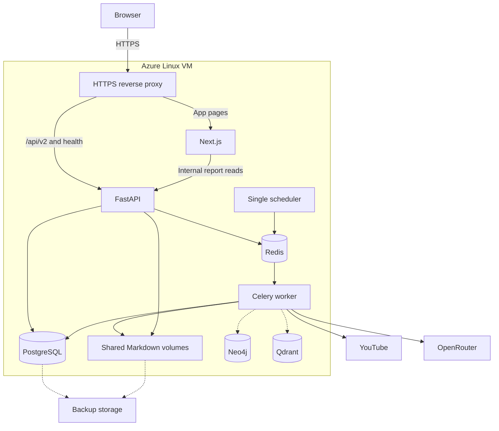

# Azure deployment plan

**Status: historical proposal, checked on 2026-10-05.** Azure infrastructure was deployed on 2026-10-06 and the VM was deallocated later that day at the owner's request. The hosted app is currently offline. Read [DEPLOYMENT.md](../../DEPLOYMENT.md) for the actual resources, verified backups, shutdown/restart steps, and remaining caption-access blocker. The account findings and proposed actions below describe the pre-deployment snapshot.

[Project overview](../../README.md) · [Architecture](../../APP.md) · [User guide](../../USERS.md) · [Admin guide](../../ADMIN.md) · [Actual deployment](../../DEPLOYMENT.md)

## 1. Pre-deployment snapshot

- The local `reviewlens` Compose project has eight healthy running services and a successfully completed migration container. Its home page returns HTTP 200 and API readiness is `ready`.
- The obsolete `reviewlens-binding` and `reviewlens-demo` test containers were removed. Their stored volumes were retained. The current application's volumes were retained.
- Compose defaults to the project name `reviewlens`. Explicit project overrides remain available for isolated acceptance tests.
- Azure CLI authentication and a live resource-group read succeeded against an enabled Azure for Students subscription. Effective subscription management permissions include unrestricted actions; policy and quota checks still apply.
- The subscription policy allows Sweden Central, Switzerland North, Poland Central, Italy North, and Spain Central. Spain Central is the proposed region, pending VM availability and quota.
- `Microsoft.Compute` is **not registered**. The CLI returned no VM usage entries, so usable VM quota has not been established. Registering the provider is a later deployment action, followed by fresh quota and SKU checks.
- Remaining student credit has not been verified. Check the [Education Hub or Sponsorships balance](https://learn.microsoft.com/en-us/azure/cost-management-billing/manage/azurestudents-subscription-disabled) before approving spend.

## 2. Proposed first deployment

Use **one Linux Azure VM running one Docker Compose project**, with a reverse proxy for HTTPS. Each application service remains in its own container. This preserves the existing shared Markdown storage and database topology.

The app currently uses about **3 GB RAM at rest**, including a worker with multiple processes. This is one local measurement, not a peak-load benchmark. Start planning with an **8 GiB RAM, x86-64 VM** and worker concurrency of two, then measure a complete run before choosing the final size. `Standard_B2s_v2` is a candidate with two vCPUs and eight GiB RAM. B-series CPU credits can cause throttling under sustained load, so the load check must include CPU behavior. [VM size and CPU-credit documentation](https://learn.microsoft.com/en-us/azure/virtual-machines/sizes/general-purpose/bsv2-series).

| Option | Fit for this app | Decision |
|---|---|---|
| One VM with Compose | Keeps the current persistent volumes, worker, scheduler, and database layout; requires host maintenance and backups | Recommended for the first demo, subject to budget and quota |
| Azure Container Apps with separate data services | Adds independent app scaling but requires storage, networking, and database changes | Consider later when those requirements justify the migration |

For Container Apps, ordinary container storage is ephemeral; persistent Markdown bodies require a supported permanent mount such as Azure Files. Its HTTP ingress also has a 240-second request timeout, which needs a reconnect check for the existing progress stream. [Storage mounts](https://learn.microsoft.com/en-us/azure/container-apps/storage-mounts), [ingress limits](https://learn.microsoft.com/en-us/azure/container-apps/ingress-overview).

## 3. Cost and availability

Public Linux consumption prices retrieved from the [Azure Retail Prices API](https://learn.microsoft.com/en-us/rest/api/cost-management/retail-prices/azure-retail-prices) on 2026-10-05 for Spain Central:

| Candidate | Compute price in USD/hour | 730 running hours | 150 running hours |
|---|---:|---:|---:|
| Standard_B2s_v2 | $0.0912 | $66.58 | $13.68 |
| Standard_B2ms | $0.0915 | $66.80 | $13.73 |
| Standard_B4ls_v2 | $0.1620 | $118.26 | $24.30 |

The candidate B2s v2 rate can be inspected in the [Spain Central retail quote](https://prices.azure.com/api/retail/prices?$filter=serviceName%20eq%20%27Virtual%20Machines%27%20and%20armRegionName%20eq%20%27spaincentral%27%20and%20armSkuName%20eq%20%27Standard_B2s_v2%27%20and%20priceType%20eq%20%27Consumption%27); use the Linux consumption entry, excluding Windows, Spot, and Low Priority entries.

These estimates cover **compute only**. Add OS/data disks, public IP, backup storage, registry if used, logs, bandwidth, applicable taxes, and OpenRouter usage. Retail prices do not establish subscription eligibility, capacity, free allowances, or remaining credit.

Choose an availability model before provisioning:

- **Always online:** easier for a recruiter to open, with continuous compute charges.
- **Scheduled demo:** fewer running hours; deallocate the VM between sessions. This makes the demo unavailable while deallocated. Shutting down the guest alone does not stop compute billing, and disks/network resources can still incur charges. [VM states and billing](https://learn.microsoft.com/en-us/azure/virtual-machines/states-billing).

Set an Azure budget alert and a separate application model-spend cap. Budget alerts are notifications, not an automatic resource shutdown. Reconfirm remaining credit before provisioning; the student account's included credit is a finite allowance. [Student usage and budgets](https://learn.microsoft.com/en-us/azure/education-hub/navigate-costs), [budget behavior](https://learn.microsoft.com/en-us/azure/cost-management-billing/costs/tutorial-acm-create-budgets).

## 4. Preparation before provisioning

1. Agree on the monthly cap, uptime schedule, region, domain/subdomain, and whether existing reports should be copied. Use a separate ReviewLens resource group.
2. Prepare a production Compose overlay and reverse-proxy configuration locally. Publish only HTTPS and HTTP for certificate issuance; keep application and database ports private. Restrict SSH to the operator's address and use SSH keys.
3. Route `/api/v2/*` to FastAPI without stripping the prefix, and page routes to Next.js on the same HTTPS origin. Configure streaming without proxy buffering. Allow enough idle time for progress events and test reconnection.
4. Set `APP_ENV=production`, `APP_PUBLIC_URL`, `API_PUBLIC_URL`, `NEXT_PUBLIC_API_BASE_URL`, `BACKEND_CORS_ORIGINS`, and `OPENROUTER_APP_URL` for the chosen HTTPS hostname. Retain `V2_API_INTERNAL_URL=http://api:8000` for server-side reads. The public API URL is baked into the frontend build, so rebuild its image for the chosen hostname.
5. Trust forwarded client headers only from the reverse proxy. Test that client-IP admission limits distinguish clients and that forged headers cannot bypass limits. Production cookies must remain Secure and admin mutations must keep their CSRF checks.
6. Prepare a private production secret file or a Key Vault retrieval path. Use dedicated model/API credentials where possible, generate production session secrets, and never place secret values in Git, build arguments, browser code, or deployment output.
7. Pin deployment images to the chosen release and record a rollback release. Use a registry or local image build according to the agreed cost and release workflow; do not assume the VM can comfortably build the frontend while serving traffic.
8. Keep PostgreSQL and Markdown storage persistent and shared among backend roles. Define coordinated backups and a restore test. If importing existing reports, preserve the relevant encryption/hash secrets and configuration records so their links remain valid.
9. Prepare production public quotas, queue limits, and model budgets through the existing admin configuration path. Start with public analysis disabled during validation; enable it after the smoke test.

No production overlay, cloud resources, secret uploads, or registry pushes have been created by this planning step.

## 5. Deployment sequence after approval

1. Recheck credit, allowed regions, and management permissions; register required providers. Verify regional and VM-family quotas and the selected SKU before any billable provisioning.
2. Review the priced resource list and infrastructure plan, then provision the dedicated resource group, VM, network rules, persistent disks, and backup storage.
3. Install the supported container runtime, deploy the chosen images and private configuration, and configure the hostname and HTTPS proxy.
4. Run the existing migration/seed job before starting API, worker, and the single scheduler. Refresh the model catalog and validate the active workflow through the admin configuration path. Preserve existing published versions when restoring data.
5. Check readiness, secure sign-in, source acquisition from the Azure IP, model routing, and budgets before opening public admission. YouTube captions may behave differently from the local network; handle acquisition failures explicitly.
6. Run one approved, capped end-to-end product analysis, inspect its cited report and comment status, and verify reconnecting progress, PDF export, and admin run/usage views.
7. Restart the app to verify persistence, restore a backup in an isolated location, and rehearse image rollback against the compatible database schema.
8. Enable public analysis within the agreed caps and update the README with the live demo link and its availability schedule.

## 6. Release checks

- Required backend, frontend, context, and mocked acceptance gates pass for the selected release.
- HTTPS, Secure cookies, CSRF, forwarded-IP handling, quotas, and model-spend enforcement pass deployment-specific checks.
- The browser makes no requests to a localhost API address; public progress streams reconnect and published reports remain readable.
- Database and graph/vector ports are unreachable from the public Internet.
- Persistent reports and Markdown survive restart; backups restore successfully.
- Observed peak RAM/CPU and source-acquisition behavior support the chosen VM and concurrency.
- A capped real analysis completes, with truthful partial/error states when sources fail.
- Budget, credit balance, availability schedule, and rollback release are recorded.

This is a single-host demo with a shared failure boundary. A highly available deployment needs a separate plan for managed data services, shared storage, scheduler ownership, worker scaling, and recovery.
